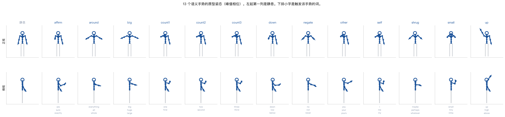
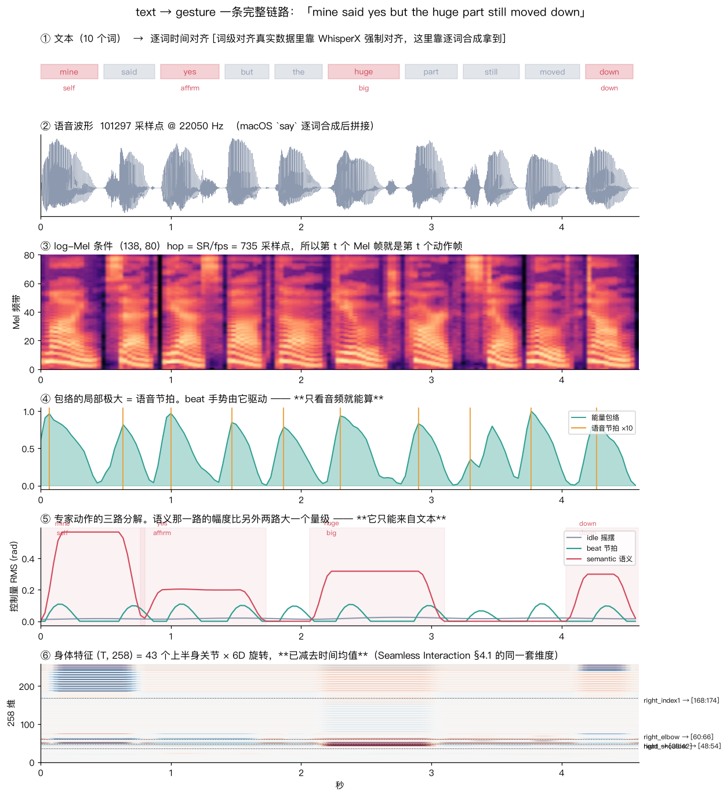
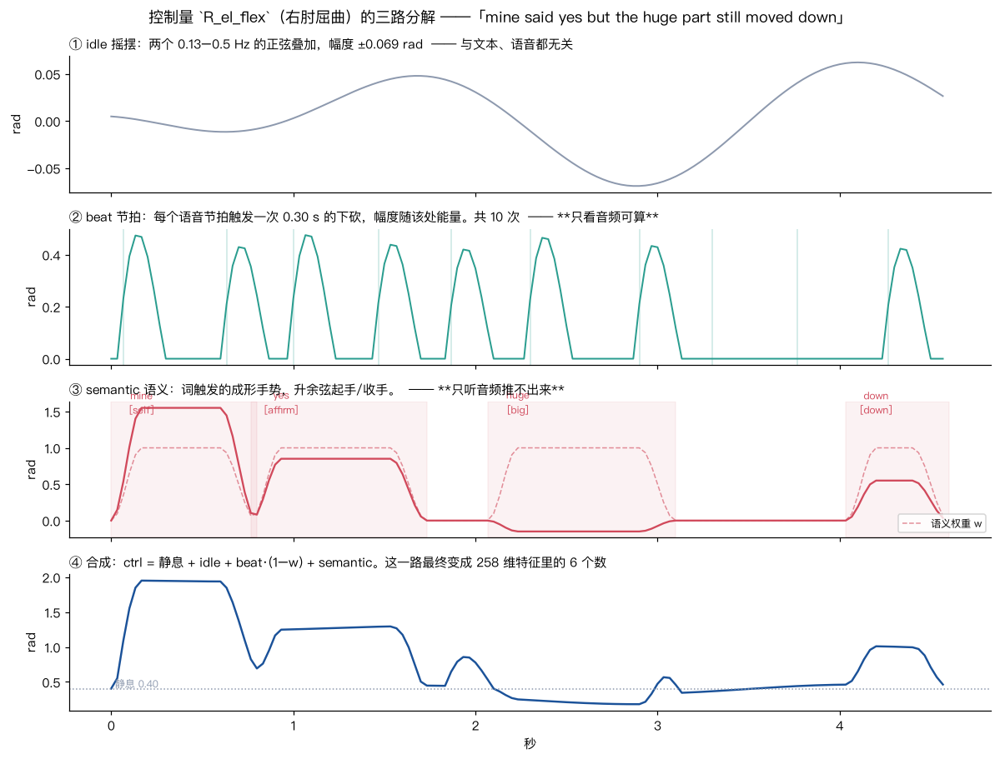
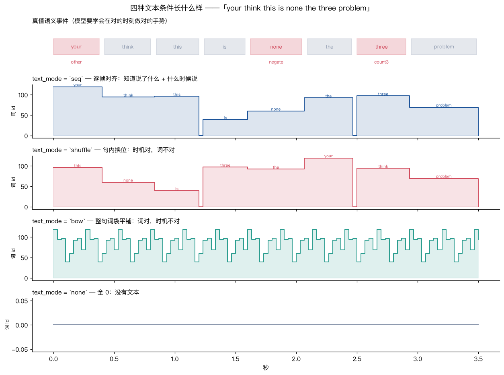
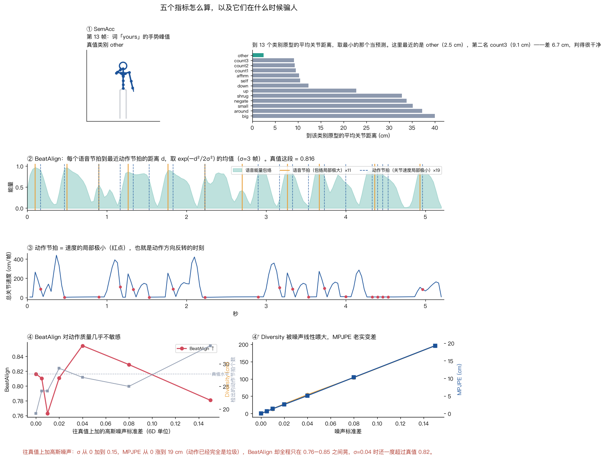

# seamless-interaction

在 Mac mini（M4, 16 GB, **无 CUDA**）上从零跑通 **text → gesture** 的完整链路：

```
文本 ──TTS──▶ 语音 ──▶ 条件特征（Mel / 语音 token  +  逐帧词嵌入）
                              │
                              ▼
                    flow-matching DiT（Seamless Interaction §4）
                              │
                              ▼
          SMPL-H 上半身 43 关节 × 6D = 258 维 ──▶ 火柴人渲染 ──▶ 评测
```

参考 [Seamless Interaction](https://arxiv.org/abs/2506.22554)（Meta 2025）和
[DiffSHEG](https://arxiv.org/abs/2401.04747)（CVPR 2024），各取一半：
前者给动作表示、flow matching、条件注入方式和 dyadic 设定，后者给
表情-手势联合建模和 FOPPAS 长序列采样。

姊妹项目：[starvla](https://github.com/ryf1123/starvla)（视觉-语言-动作）、
[sonic](https://github.com/ryf1123/sonic)（人形运控）。

## 这个项目在回答什么

**text → gesture 里，text 到底贡献了什么？**

答案拆成两半：**节奏（beat）来自语音的能量包络，语义（semantic gesture）只能来自文本。**

为了让这句话**可证伪**，数据不是拿来的，是我们按已知规则造的：

| 成分 | 由什么驱动 | 能不能只从音频推出来 |
|---|---|---|
| idle 摇摆 | 随机慢正弦 | 不需要（本来就是噪声） |
| beat 节拍 | 语音包络的局部极大 | ✅ 能 |
| **semantic 语义手势** | **词**（13 类：指自己 / 比大小 / 数数 / 摇头否定 / …） | ❌ **不能** |

于是「把文本条件去掉，语义手势命中率会塌到多少」是一个能直接量出来的数。
这正是 Seamless Interaction 论文 §4.4.3 说的长尾语义手势问题的可控缩小版。



## 一条句子走完整条链路



三路成分怎么叠成最终动作：



四种文本条件的区别（第二环消融的说明书）：



## 快速开始

```bash
uv venv --python 3.11 .venv && source .venv/bin/activate
uv pip install numpy scipy torch torchaudio matplotlib imageio imageio-ffmpeg pyyaml tqdm soundfile

# 造数据：400 句 ≈ 33 分钟语音 / 5.9 万帧动作，约 2.5 分钟（TTS 缓存并行预热）
python -m si.dataset 400

# 训练主基线（flow matching，Mel + 逐帧词 id），MPS 上 8000 步约 1 小时
python -m si.train --config configs/flow_body.yaml --name flow_body

# 闭环评测：FGD / MPJPE / BeatAlign / Diversity / 语义命中率
python -m si.eval --run runs/flow_body --video 3

# 消融：文本条件到底有没有用
python -m si.ablate --suite text --steps 5000
python -m si.report --ablation runs/ablation_text.json --out docs/figs/ablation_text.png
```

各模块可以单独跑，每个都会打印自己的规格：

```bash
python -m si.skeleton          # 关节表、258 维怎么排、静息姿态坐标
python -m si.pose              # 29 个控制自由度和静息值
python -m si.corpus            # 语料和 13 个语义类别的分布
python -m si.tts               # 逐词合成 + 词级对齐表
python -m si.gesture_expert    # 一条句子的三路分解
python -m si.render            # 渲染一段带音轨的演示视频
python scripts/walkthrough.py  # 把整条链路的形状和数值打印一遍
```

## 指标

**每个指标都会在某个地方骗人**，所以下表的第三列比前两列重要。
最狠的一条是实测出来的：往真值上加高斯噪声，MPJPE 从 0 涨到 19 cm、动作已经完全是垃圾，
而 BeatAlign 全程只在 0.76–0.85 之间晃，σ=0.04 时还一度**超过真值**。



| 指标 | 是什么 | 什么时候会骗人 |
|---|---|---|
| **SemAcc ★** | 语义词的手势峰值帧判成 13 类里的哪一类，准确率 | 主指标，随机基线 7.7% |
| FGD | 动作自编码器隐空间里的 Fréchet 距离 | 分布层面的指标，单条不可解释 |
| MPJPE | 逐帧关节位置误差（cm） | **多对多任务天生不利**，生成式模型故意不复现真值 |
| BeatAlign | 手势节拍与语音节拍的 Chamfer 相似度 | **对动作质量几乎不敏感**（见上图，论文原文也提醒过） |
| Diversity | 同条件多次采样之间的平均距离 | 同上，抖动也会刷高 |

## 目录

```text
si/rotation.py        6D ↔ 旋转矩阵 ↔ 轴角
si/skeleton.py        SMPL-H 52 关节树、上半身 43 关节、正运动学
si/pose.py            29 个有名字的控制自由度 ↔ 258 维特征
si/corpus.py          带类型槽位的模板语料 + 13 类语义手势词表
si/tts.py             macOS `say` 逐词合成 + 拼接（词级对齐精确到帧）
si/gesture_expert.py  规则专家：idle + beat + semantic 三路叠加
si/dataset.py         建库落盘；si/data_torch.py 窗口切分、归一化、条件模式开关
si/features.py        log-Mel / 离散语音 token / 四种文本模式
si/models/dit.py      条件 DiT（RMSNorm、QK-Norm、adaLN-Zero、条件相加）
si/flow.py            flow matching 训练目标、ODE 采样、FOPPAS outpainting
si/train.py           训练入口（--config + --set 覆盖）
si/eval.py            闭环采样评测；si/metrics.py 五个指标
si/ablate.py          消融套件；si/report.py 表格与图
scripts/explain_*.py  讲解图，输出 docs/figs/
notes/                每一环一页笔记
```

## 文档

- [PLAN.md](PLAN.md) —— 七环计划
- [docs/concepts.md](docs/concepts.md) —— **概念速查**：每个设计决策是什么 / 为什么 / 在哪个文件 / 出自哪篇论文；训练曲线怎么看；建议的阅读顺序
- [notes/00-表示与数据.md](notes/00-表示与数据.md) —— 258 维是怎么来的、数据是怎么造的、踩了哪些坑
- [notes/01-条件与模型.md](notes/01-条件与模型.md) —— 条件为什么相加、四种文本模式在测什么、flow matching 的真实数值
- [notes/02-第一批结果.md](notes/02-第一批结果.md) —— 主基线数字、SemAcc 的分数结构、反事实换词、FOPPAS、**三个被数据否掉的假设**

## 计划

当前进度：

| 环 | 内容 | 状态 |
|---|---|---|
| 0 | 表示与数据：6D / SMPL-H 43 关节 / 控制层 / 规则专家 / 400 句数据 | ✅ |
| — | 主基线 + 反事实换词 + SemAcc 分数结构（见 [notes/02](notes/02-第一批结果.md)） | ✅ SemAcc **73.0%**（随机 7.7%，真值上限 100%） |
| 1 | 生成式 vs 确定性（flow matching vs L1 回归） | 🔄 |
| 2 | **文本到底有没有在起作用**（seq / shuffle / bow / none） | 🔄 |
| 3 | 语音表示（Mel / 离散 token / 包络 / 无） | 🔄 |
| 4 | 长序列 FOPPAS | ✅ 一测：接缝测不出来，因为生成本身就抖；顺序改成先压抖动 |
| 5 | 表情 + 手势：联合 vs 级联，单向信息流 | ⬜ |
| 6 | 双人（dyadic）条件 | ⬜ |
| 7 | 泛化边界 | ⬜ |
