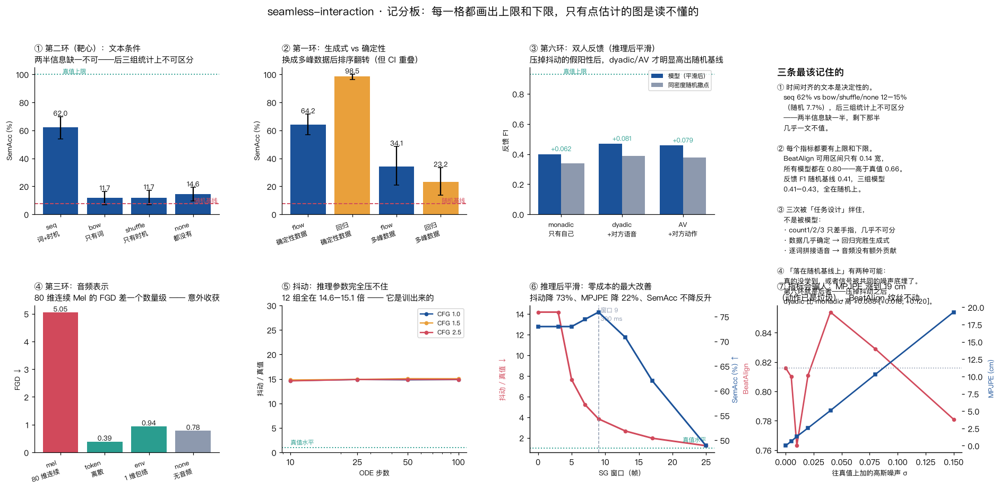
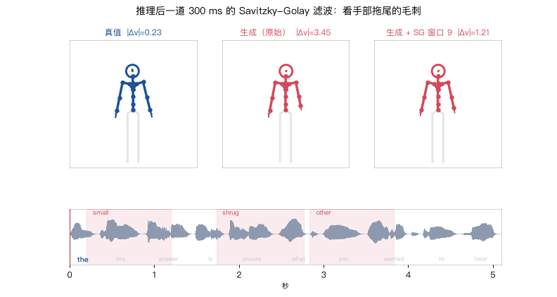
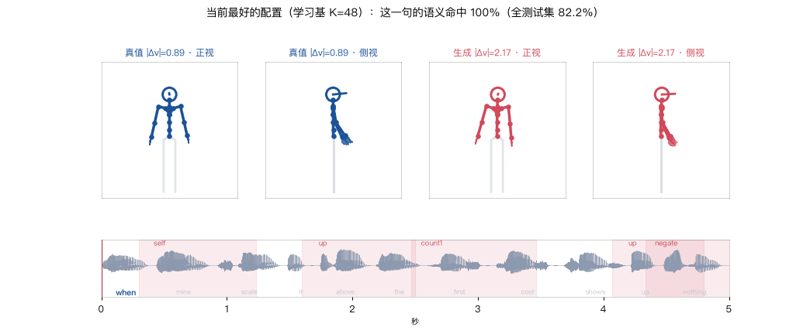

# seamless-interaction

在 Mac mini（M4, 16 GB, **无 CUDA**）上从零跑通 **text → gesture** 的完整链路：

```
文本 ──TTS──▶ 语音 ──▶ 条件特征（Mel / 语音 token  +  逐帧词嵌入）
                              │
                              ▼
                    flow-matching DiT（Seamless Interaction §4）
                              │
                              ▼
          SMPL-H 上半身 43 关节 × 6D = 258 维 ──▶ 火柴人渲染 ──▶ 评测
```

参考 [Seamless Interaction](https://arxiv.org/abs/2506.22554)（Meta 2025）和
[DiffSHEG](https://arxiv.org/abs/2401.04747)（CVPR 2024），各取一半：
前者给动作表示、flow matching、条件注入方式和 dyadic 设定，后者给
表情-手势联合建模和 FOPPAS 长序列采样。

姊妹项目：[starvla](https://github.com/ryf1123/starvla)（视觉-语言-动作）、
[sonic](https://github.com/ryf1123/sonic)（人形运控）。

## 一页记分板



每一格都画出**上限和下限**——只有点估计的图是读不懂的：
0.42 是好是坏，取决于随机基线是 0.41 还是 0.05。

## 先看视频（手势这种东西，看动的比看静的清楚）

六段视频都在 [`videos/`](videos/)，带音轨的 `.mp4` 用来正常观看，下面内嵌的是 GIF 版。

### 1. 13 个语义手势长什么样

每个手势都念出触发它的词。这是整个项目的"词表"。

[▶ videos/01_gesture_atlas.mp4](videos/01_gesture_atlas.mp4)（带音轨，20 秒）

### 2. 一条句子的完整专家动作

底下是波形 + 词条，当前词加粗，粉色带是语义手势的时间窗；手腕拖尾能看出运动方向。


### 3. 同一条语音，只改文本条件 ★

**这是本项目最有说服力的一张。** 左起：真值、`seq`（逐帧词 id）、`shuffle`、`bow`、`none`。
只有 `seq` 那一路的姿态在不同语义词上真的变化；另外三路基本是同一个姿势重复。


### 4. 同一条语音，只换一个词

音频一个采样点都没动，只把文本条件里的 `high` 换成 `low`，生成的手势从"向上"翻成"向下"。


### 5. 真值 vs 生成：抖动

注意手部拖尾。真值（蓝）是光滑的弧线，生成（红）是毛刺。
这一条是当前最大的质量瓶颈，量化结果见下面的"抖动"一节。


### 6. 推理后平滑：零成本的最大改善 ★

生成完之后加一道 300 ms 的 Savitzky-Golay 滤波（论文对训练数据就这么做的）。
看手部拖尾：中间是原始生成的毛刺，右边是滤完的。
抖动 |Δv| 从 3.45 降到 1.21，全测试集上抖动降 73%、MPJPE 降 22%、SemAcc 涨 2.9 个百分点。
代价是 FGD 大幅变差——不是免费的，详见 [notes/10](notes/10-推理后平滑.md)。



### 7. 当前系统最好的输出 ★

2000 句训的模型 + 推理后 SG 滤波，和真值并排。标题里实时显示这一帧该做哪个语义手势、
生成的被判成了什么、对不对——**包括判错的**。



### 8. 双人：倾听时的点头

反馈动作只出现在"我在听"的区间里。


## 这个项目在回答什么

**text → gesture 里，text 到底贡献了什么？**

答案拆成两半：**节奏（beat）来自语音的能量包络，语义（semantic gesture）只能来自文本。**

为了让这句话**可证伪**，数据不是拿来的，是我们按已知规则造的：

| 成分 | 由什么驱动 | 能不能只从音频推出来 |
|---|---|---|
| idle 摇摆 | 随机慢正弦 | 不需要（本来就是噪声） |
| beat 节拍 | 语音包络的局部极大 | ✅ 能 |
| **semantic 语义手势** | **词**（13 类：指自己 / 比大小 / 数数 / 摇头否定 / …） | ❌ **不能** |

于是「把文本条件去掉，语义手势命中率会塌到多少」是一个能直接量出来的数。
这正是 Seamless Interaction 论文 §4.4.3 说的长尾语义手势问题的可控缩小版。


## 一条句子走完整条链路


三路成分怎么叠成最终动作：


四种文本条件的区别（第二环消融的说明书）：


## 快速开始

```bash
uv venv --python 3.11 .venv && source .venv/bin/activate
uv pip install numpy scipy torch torchaudio matplotlib imageio imageio-ffmpeg pyyaml tqdm soundfile

# 造数据：400 句 ≈ 33 分钟语音 / 5.9 万帧动作，约 2.5 分钟（TTS 缓存并行预热）
python -m si.dataset 400

# 训练主基线（flow matching，Mel + 逐帧词 id），MPS 上 8000 步 52 分钟
python -m si.train --config configs/flow_body.yaml --name flow_body

# 闭环评测：FGD / MPJPE / BeatAlign / Diversity / 语义命中率
python -m si.eval --run runs/flow_body --video 3

# 消融：文本条件到底有没有用
python -m si.ablate --suite text --steps 5000
python -m si.report --ablation runs/ablation_text.json --out docs/figs/ablation_text.png
```

各模块可以单独跑，每个都会打印自己的规格：

```bash
python -m si.skeleton          # 关节表、258 维怎么排、静息姿态坐标
python -m si.pose              # 29 个控制自由度和静息值
python -m si.corpus            # 语料和 13 个语义类别的分布
python -m si.tts               # 逐词合成 + 词级对齐表
python -m si.gesture_expert    # 一条句子的三路分解
python -m si.render            # 渲染一段带音轨的演示视频
python -m si.dyadic            # 打印一段双人对话的结构
python scripts/walkthrough.py  # 把整条链路的形状和数值打印一遍
python scripts/selfcheck.py    # 跑一遍所有不变量（改了表示层/专家/指标之后先跑这个）
python scripts/results_table.py # 汇总所有 run 的评测结果（写文档前核对数字有没有过期）
```

## 当前最好的配置，以及今天试过的所有东西

```bash
python -m si.dataset 2000 --out data/toy2k
python -m si.train --config configs/flow_body.yaml --name best \
       --set data=data/toy2k audio_mode=token ema=0.999 steps=12000 sem_every=1000
python -m si.eval --run runs/best --smooth 9
```

| | **SemAcc ★** | 95% 区间 | MPJPE | 抖动 / 真值 |
|---|---|---|---|---|
| 起点（400 句 / Mel / 8000 步） | 73.0 % | [65.3, 79.3]（40 句测试集） | 9.53 cm | 14.17× |
| 2000 句 / token / 12000 步 + EMA | 70.3 % | [66.8, 73.8]（200 句测试集） | 10.02 cm | 16.43× |
| **↑ + 推理后 SG 滤波（窗口 9）** | **76.1 %** | **[73.0, 79.1]** | **7.43 cm** | **4.36×** |

平滑的提升在同一批 200 条句子上配对比较是 **+5.8 个百分点 [+2.5, +9.1]**，区间不含 0。

**今天唯一奏效的是那个零成本的后处理步骤。训练侧的每一个想法都是中性或负面的：**

| 试过的 | 结果 |
|---|---|
| 推理参数（CFG × ODE 步数，12 组） | 无效 |
| 权重 EMA | 无效（且作用取决于有没有过拟合） |
| 速度损失 λ_v = 5 / 20 | 降 24% 抖动，代价 SemAcc −8；λ_v=20 两头都输 |
| Huber 重建损失 | 无额外贡献 |
| 离散语音 token 条件 | 同步数下 FGD 好 13 倍，但训久了 Mel 追上来 |
| 训练更久（5000 → 10000 步） | **有害**：SemAcc 72.3 % → 59.1 %，而 val loss 降 25% |
| 数据量 ×5（400 → 2000 句） | SemAcc 无可测变化；但**置信区间减半**（14.0 → 7.0 个百分点），FGD 好到 0.130 |
| 模型内低通核（噪声未处理） | **有害**：抖动反涨到 22.74×（对 flow matching 的误解，见 notes/12） |
| **低通核 + 低通噪声**（band-limited） | 抖动 15.11× → **3.80×**，FGD 只掉到 1.075（事后滤波是 22.8）；代价 SemAcc −10 |
| 推理后 Savitzky-Golay 滤波 | ✅ **抖动 −73%，MPJPE −22%，SemAcc +2.9** |

清单和依据见 [docs/improve.md](docs/improve.md)。

## 结果

完整讨论见 `notes/`，这里只列结论和关键数字。**每个数都配了上限和下限**——
只有点估计的数是读不懂的。

### 第二环（靶心）：文本条件不是「有帮助」，是决定性的

四组只差一个变量（`text_mode`），音频、模型、训练步数全同：

| 组 | 携带的信息 | **SemAcc** |
|---|---|---|
| `seq` 逐帧对齐的词 id | 说了什么 ✅ + 什么时候说 ✅ | **62.0 %** [53.8, 69.8] |
| `bow` 整句词袋 | 说了什么 ✅ + 什么时候说 ❌ | 11.7 % [7.0, 16.4] |
| `shuffle` 句内换位 | 说了什么 ❌ + 什么时候说 ✅ | 11.7 % [6.8, 17.1] |
| `none` 没有文本 | 都没有 | 14.6 % [9.7, 19.3] |

随机基线 7.7%，真值上限 100%。

配对 McNemar（所有组评的是同一批 137 个事件）把结论从「判不出差别」升级成
**「它们就是同一个模型」**——最有信息量的是**不一致率**：

| 对比 | 不一致事件 | 谁对/谁对 | p |
|---|---|---|---|
| `seq` vs `none` | **85/137 = 62.0%** | 75 / 10 | **< 0.0001** |
| `bow` vs `none` | 10/137 = **7.3%** | 3 / 7 | 0.34 |
| `bow` vs `shuffle` | 18/137 = 13.1% | 9 / 9 | **1.0000** |

`bow` 和 `none` 在 137 个事件里只有 10 个给出不同答案，还是 3 比 7 分；
`bow` 和 `shuffle` 是 9 比 9，完美对称。**不是样本量不够，是行为上就是同一个模型。**
所以不是「知道词拿一半分、知道时机拿另一半」，而是两半缺任何一半，剩下那半几乎一文不值。
这解释了论文 §4.4.3 为什么给语义手势加的是**逐帧**条件而不是句子级标签。

### 第一环：生成式 vs 确定性，取决于数据是不是真的多对多

确定性数据上回归完胜（98.5% vs 64.2%）——因为那份数据给定条件后动作几乎唯一
（条件变异 3.37 cm），回归的 MPJPE 3.86 cm 已经贴着噪声底。

换成**2000 句多峰数据**后排序彻底翻转，而且这次是决定性的
（200 条测试句 / 664 个事件）：

| 组 | SemAcc | 95% 区间 | MPJPE | 抖动 | 多样性 |
|---|---|---|---|---|---|
| flow matching | **26.3 %** | [21.2, 31.6] | 17.39 cm | 8.24× | 138.1 cm |
| L1 回归 | 8.0 % | [5.2, 11.2] | **10.99 cm** | **1.38×** | **0.00 cm** |

配对 McNemar：**+17.4 个百分点，63 比 5，p < 0.0001**。
**回归的 SemAcc（8.0%）已经掉到随机基线（7.7%）上**——
它输出的是一个平滑（抖动 1.38×，接近真值）、低误差（MPJPE 最低）、
但语义上完全无意义的平均动作。这是「回归到均值」最直观的一次呈现。

**最硬的一条**：多峰数据上回归的 MPJPE 是理论下限的 **1.04 倍**——
它把 MPJPE 做到几乎不能再好，SemAcc 却只有 23.2%。
MPJPE 分不清「做对了手势」和「把所有手势平均了一下」。

### 第六环：双人反馈全在随机基线上

| 条件 | 反馈 F1 | 同密度随机基线 |
|---|---|---|
| 只有自己的语音 | 0.412 | 0.407 |
| + 对方的语音 | 0.420 | 0.413 |
| + 对方的动作 | 0.429 | 0.399 |

真值上限 0.929。三组**全部落在随机水平**——这和 GENEA Challenge 2023 的结论一致。

**但这个结论后来被推翻了。** 生成的动作抖，点头检测器把抖动当成点头
（三组各生成 431–467 个点头去对 187 个真值事件），
**三组的真实差异被埋在共同的噪声底下面**。加上推理后平滑再评：

| 组 | 反馈 F1 | 同密度随机基线 | 超出随机 | 检出点头 |
|---|---|---|---|---|
| 只有自己的语音 | 0.400 | 0.338 | +0.062 | 267 |
| + 对方的语音 | **0.469** | 0.388 | **+0.081** | 369 |
| + 对方的动作 | 0.457 | 0.378 | +0.079 | 343 |

按句配对的差值：`dyadic − monadic = +0.068` [+0.018, +0.120]，
`AV − monadic = +0.057` [+0.007, +0.113]——**区间都不含 0**。

所以对话者的信息**确实**产生了可测的改善，只是不平滑的时候看不见。
详见 [notes/06](notes/06-第六环结果-双人.md) 末尾的修订。

### 抖动：四次干预定位到根因

| 干预对象 | 手段 | 效果 |
|---|---|---|
| 采样噪声 | CFG 权重 × ODE 步数（12 组） | **无效**，全在 14.6–15.1 倍 |
| 权重噪声 | EMA decay 0.999 | **无效**，降 2%，SemAcc −6.6 |
| 训练目标 | 速度损失 λ_v = 5 | 降 24%，SemAcc −8 |
| **输出本身** | Savitzky-Golay 滤波，窗口 9（300 ms） | **降 73%，MPJPE 降 22%，SemAcc +5.8** |
| **函数类 + 噪声先验** | 低通核 + 低通噪声（band-limited） | 降 75%，**FGD 只掉到 1.075**（事后滤波是 22.8），代价 SemAcc −10 |
| 训练目标（平滑先验） | 加速度惩罚 λ_acc = 1 / 10 / 50 | 降 34% / 55% / 76%，代价 SemAcc −17.6 / −53.3 / **−62.8**（掉到随机基线）——被事后滤波严格支配 |

**六次干预放在一起，能被一个机制解释**：抖动和真实运动在「加速度幅度」这个**标量**上分不开
（λ_acc=50 时模型的加速度仍是真值的 2.49 倍，SemAcc 却已塌到随机基线），
只有在**频域**上才分得开。而 Savitzky-Golay 恰恰是为「保住峰的高度和宽度、同时滤掉噪声」
设计的——这就是它唯一不用付代价的原因。详见 [notes/16](notes/16-抖动这条线的收尾.md)。

前两条排除了「抖动来自随机性」，后两条效果好一个量级——
**抖动是模型学到的那个函数本身的性质**。代价是 FGD 大幅变差
（其中一部分是指标假象：把真值自己滤一遍 FGD 也会从 0 涨到 1.30）。

## 指标

**每个指标都会在某个地方骗人**，所以下表的第三列比前两列重要。
最狠的一条是实测出来的：往真值上加高斯噪声，MPJPE 从 0 涨到 19 cm、动作已经完全是垃圾，
而 BeatAlign 全程只在 0.76–0.85 之间晃，σ=0.04 时还一度**超过真值**。


| 指标 | 是什么 | 什么时候会骗人 |
|---|---|---|
| **SemAcc ★** | 语义词的手势峰值帧判成 13 类里的哪一类，准确率 | 主指标，随机基线 7.7% |
| FGD | 动作自编码器隐空间里的 Fréchet 距离 | 分布层面的指标，单条不可解释 |
| MPJPE | 逐帧关节位置误差（cm） | **多对多任务天生不利**，生成式模型故意不复现真值 |
| BeatAlign | 手势节拍与语音节拍的 Chamfer 相似度 | **对动作质量几乎不敏感**（见上图，论文原文也提醒过） |
| Diversity | 同条件多次采样之间的平均距离 | 同上，抖动也会刷高 |

## 目录

```text
si/rotation.py        6D ↔ 旋转矩阵 ↔ 轴角
si/skeleton.py        SMPL-H 52 关节树、上半身 43 关节、正运动学
si/pose.py            29 个有名字的控制自由度 ↔ 258 维特征
si/corpus.py          带类型槽位的模板语料 + 13 类语义手势词表
si/tts.py             macOS `say` 逐词合成 + 拼接（词级对齐精确到帧）
si/gesture_expert.py  规则专家：idle + beat + semantic 三路叠加
si/dataset.py         建库落盘；si/data_torch.py 窗口切分、归一化、条件模式开关
si/dyadic.py          双人对话数据：说话方三路 + 倾听方由**对方语音**触发的反馈动作
si/dyadic_data.py     双人的 torch 侧 + 反馈动作时间对齐指标
si/features.py        log-Mel / 离散语音 token / 四种文本模式
si/models/dit.py      条件 DiT（RMSNorm、QK-Norm、adaLN-Zero、条件相加）
si/flow.py            flow matching 训练目标、ODE 采样、FOPPAS outpainting
si/train.py           训练入口（--config + --set 覆盖）
si/eval.py            闭环采样评测；si/metrics.py 五个指标
si/ablate.py          消融套件；si/report.py 表格与图
scripts/explain_*.py  讲解图，输出 docs/figs/
scripts/walkthrough.py 链路走读；scripts/selfcheck.py 全部不变量自检
scripts/counterfactual.py 换一个词看手势变不变；scripts/video_grid.py 同屏对比
notes/                每一环一页笔记
```

## 横向：五个项目撞到的同一批墙

同一台机器上还有 [sonic](https://github.com/ryf1123/sonic)（人形运控）、
[starvla](https://github.com/ryf1123/starvla)（视觉-语言-动作）、facial（机器人表情）三个姊妹项目。
任务、模态、算法全不一样，**却反复撞到同一批墙**：

1. 代理指标和主指标在「不坏的区间」里脱钩（四个项目各自撞到）
2. 看起来是模型的问题，其实是任务设计的问题
3. 没有上限和下限，任何分数都读不懂
4. 非配对区间会浪费一到两个数量级的统计效率
5. 加数据买到的不是同分布上的精度
6. 第一个解释通常是错的
7. 负面结果的比例远高于预期

并排的数字和出处见 **[docs/cross-project.md](docs/cross-project.md)**。
能被四个独立任务重复撞到的东西，比任何单个项目的结论都值钱。

## 文档

- [PLAN.md](PLAN.md) —— 七环计划
- [docs/improve.md](docs/improve.md) —— **怎么把效果做上去**：按性价比排的清单，每条写清成本、预期收益、怎么验证、依据；含已验证无效的（推理参数）和意外有效的（音频条件换成离散 token，FGD 5.05 → 0.39）
- [docs/literature.md](docs/literature.md) —— **文献地图**：这条线是怎么走过来的、每一步在解什么问题、本项目复现了什么又修正了什么；含 GENEA 挑战赛关于「客观指标不可信」和「对话者适配性接近随机」的两条结论
- **[docs/one-page.md](docs/one-page.md) —— ★ 从这里开始读**：结论、支撑数字、边界、方法纪律、下一步
- [docs/cross-project.md](docs/cross-project.md) —— **五个项目撞到的同一批墙**：横向并排的数字和出处
- [docs/concepts.md](docs/concepts.md) —— **概念速查**：每个设计决策是什么 / 为什么 / 在哪个文件 / 出自哪篇论文；训练曲线怎么看；建议的阅读顺序
- [notes/00-表示与数据.md](notes/00-表示与数据.md) —— 258 维是怎么来的、数据是怎么造的、踩了哪些坑
- [notes/01-条件与模型.md](notes/01-条件与模型.md) —— 条件为什么相加、四种文本模式在测什么、flow matching 的真实数值
- [notes/02-第一批结果.md](notes/02-第一批结果.md) —— 主基线数字、SemAcc 的分数结构、反事实换词、FOPPAS、**三个被数据否掉的假设**
- [notes/06-第六环结果-双人.md](notes/06-第六环结果-双人.md) —— 双人三组的结果、我把 BeatAlign 的缺陷造进了自己的指标、以及「指标必须同时有上限和下限」
- [notes/13-数据量.md](notes/13-数据量.md) —— 数据翻五倍：模型没变好，但置信区间减半；以及 EMA 的作用完全取决于有没有过拟合
- [notes/12-把平滑放进模型里.md](notes/12-把平滑放进模型里.md) —— 从数学上预判、然后被数据证实的一次失败：flow matching 的样本是「噪声 + 速度场积分」，只限制速度场不等于限制样本
- [notes/11-val-loss-会骗人.md](notes/11-val-loss-会骗人.md) —— **val loss 降 25%、SemAcc 掉 13 个百分点**，而 `best.pt` 一直是按 val loss 选的；已改成同时存 `best_sem.pt`
- [notes/10-推理后平滑.md](notes/10-推理后平滑.md) —— **零成本的最大改善**：推理后一道 300 ms 的 Savitzky-Golay 滤波，抖动降 73%、MPJPE 降 22%、SemAcc 涨 2.9 个百分点；但 FGD 大幅变差，而且这里面有一部分是指标假象
- [notes/09-第八环-平滑性.md](notes/09-第八环-平滑性.md) —— 速度损失能压 24% 抖动但要拿 8 个百分点的 SemAcc 去换，λ_v=20 两头都输；抖动仍未解决
- [notes/08-第三环-语音表示.md](notes/08-第三环-语音表示.md) —— 音频在这份数据上几乎没有额外贡献（任务设计问题，第三次）；以及我自己给 BeatAlign 犯的同一个毛病
- [notes/07-抖动.md](notes/07-抖动.md) —— 三个环撞到的同一个根因；推理参数扫描（12 组）证明抖动是训出来的
- [notes/05-第一环-任务设计的坑.md](notes/05-第一环-任务设计的坑.md) —— **今晚最有价值的一条**：确定性回归完胜生成式，因为我造的数据不是多对多的；怎么量「噪声底」，怎么把任务改回多峰
- [notes/04-第二环-文本到底有没有用.md](notes/04-第二环-文本到底有没有用.md) —— **靶心结果**：四组文本条件的对照，以及「两半信息缺一不可」这条结论
- [notes/03-双人设计.md](notes/03-双人设计.md) —— 双人数据怎么造、三组条件消融的搭法、反馈对齐指标（真值上限 0.998）、一个符号错误和一个内存坑

## 计划

当前进度：

| 环 | 内容 | 状态 |
|---|---|---|
| 0 | 表示与数据：6D / SMPL-H 43 关节 / 控制层 / 规则专家 / 400 句数据 | ✅ |
| — | 主基线 + 反事实换词 + SemAcc 分数结构（见 [notes/02](notes/02-第一批结果.md)） | ✅ SemAcc **73.0%**（随机 7.7%，真值上限 100%） |
| 1 | 生成式 vs 确定性（flow matching vs L1 回归） | ✅ 确定性数据上回归完胜（98.5% vs 64.2%）→ 诊断为**任务设计**问题 → 多峰数据上排序翻转（flow 34.1% vs 回归 23.2%，但 CI 重叠）。最硬的一条：回归的 MPJPE 已贴到理论下限的 1.04 倍，SemAcc 却只有 23.2%——[notes/05](notes/05-第一环-任务设计的坑.md) |
| 2 | **文本到底有没有在起作用**（seq / shuffle / bow / none） | ✅ seq **62.0%** vs bow 11.7% / shuffle 11.7% / none 14.6%（随机 7.7%）——[notes/04](notes/04-第二环-文本到底有没有用.md) |
| 3 | 语音表示（log-Mel / 离散语音 token / 只有包络 / 无） | ✅ token 最好（FGD 0.39 / SemAcc 72.3%）；但**没有音频的组超出随机基线 +0.091，和有 Mel 的 +0.107 几乎一样**——[notes/08](notes/08-第三环-语音表示.md) |
| 4 | 长序列 FOPPAS | ✅ 一测：接缝测不出来，因为生成本身就抖；顺序改成先压抖动 |
| 5 | 表情 + 手势：联合 vs 级联，单向信息流 | ⬜ |
| 6 | 双人（dyadic）条件：倾听时的点头只能由对方的语音解释 | ⚠️ 三组的反馈 F1 全部落在随机基线上（0.41 vs 上限 0.93）；但不依赖检测器的耦合度显示**信息只从对方的「动作」进来了**（0.066，真值 0.076），从对方的「原始语音」没有（0.008）——[notes/06](notes/06-第六环结果-双人.md) |
| 7 | 泛化边界 | ⬜ |
| 8 | **平滑性**：速度损失 / Huber 能不能压住抖动 | ✅ 只压得动 24%，且代价是 SemAcc −8 个百分点——[notes/09](notes/09-第八环-平滑性.md) |
