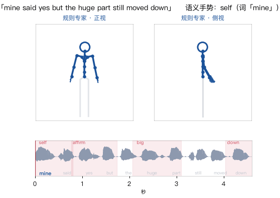
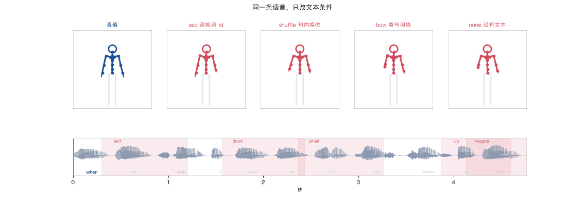
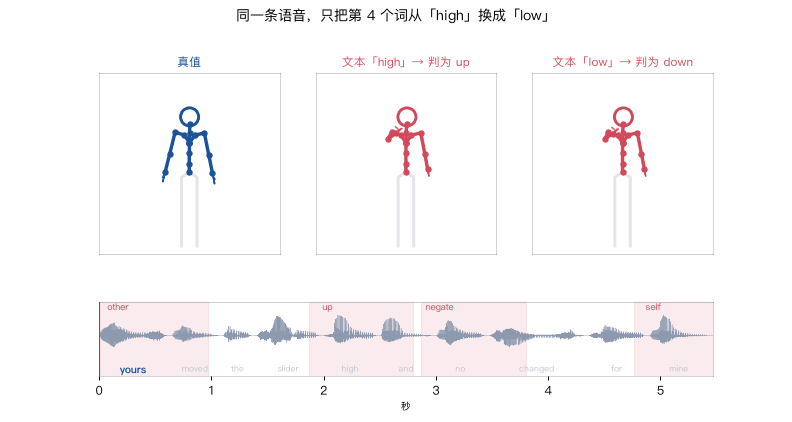
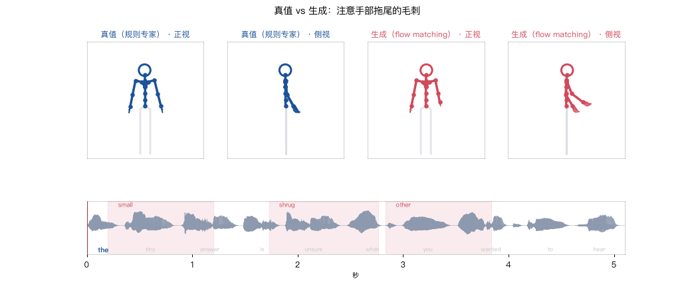
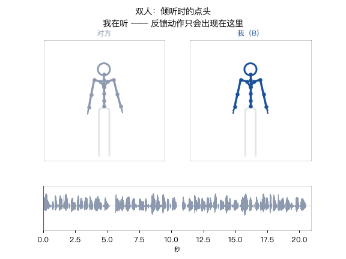
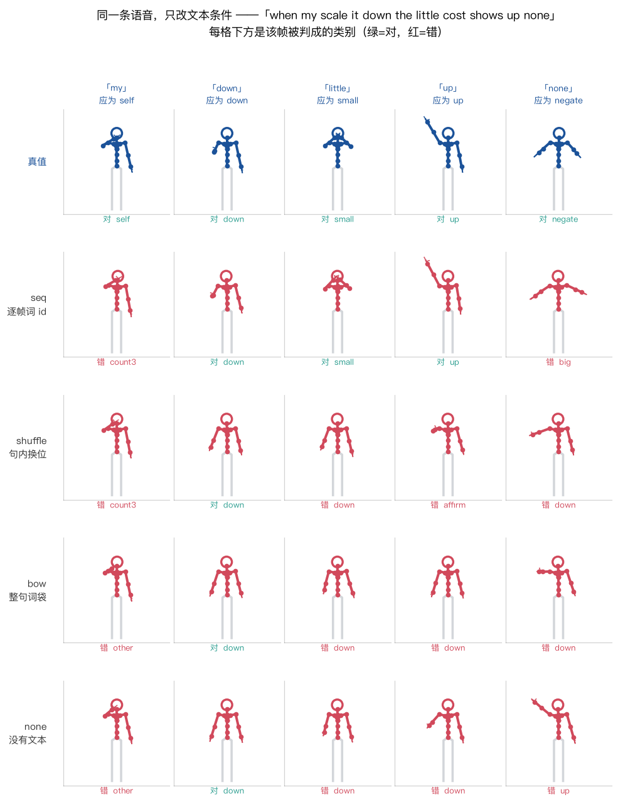
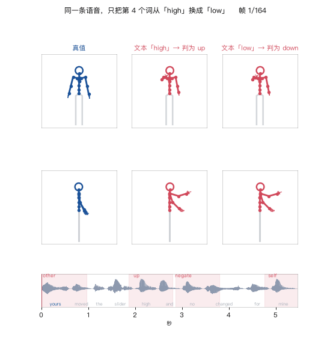
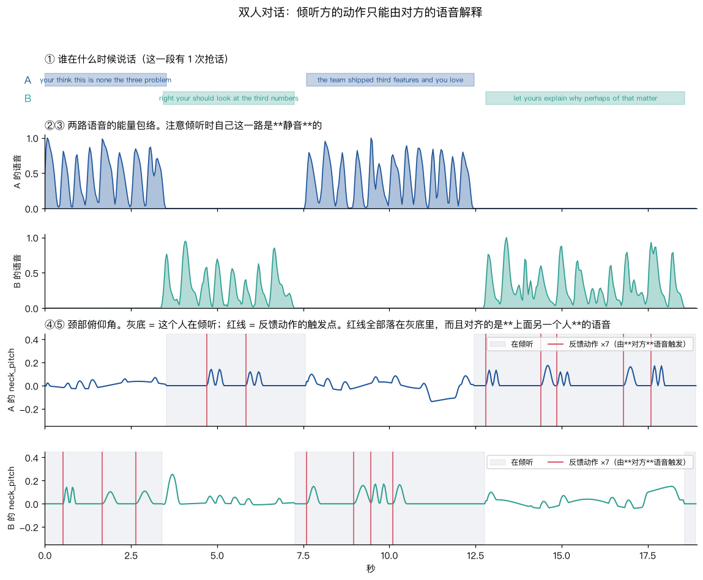

# seamless-interaction

在 Mac mini（M4, 16 GB, **无 CUDA**）上从零跑通 **text → gesture** 的完整链路：

```
文本 ──TTS──▶ 语音 ──▶ 条件特征（Mel / 语音 token  +  逐帧词嵌入）
                              │
                              ▼
                    flow-matching DiT（Seamless Interaction §4）
                              │
                              ▼
          SMPL-H 上半身 43 关节 × 6D = 258 维 ──▶ 火柴人渲染 ──▶ 评测
```

参考 [Seamless Interaction](https://arxiv.org/abs/2506.22554)（Meta 2025）和
[DiffSHEG](https://arxiv.org/abs/2401.04747)（CVPR 2024），各取一半：
前者给动作表示、flow matching、条件注入方式和 dyadic 设定，后者给
表情-手势联合建模和 FOPPAS 长序列采样。

姊妹项目：[starvla](https://github.com/ryf1123/starvla)（视觉-语言-动作）、
[sonic](https://github.com/ryf1123/sonic)（人形运控）。

## 先看视频（手势这种东西，看动的比看静的清楚）

六段视频都在 [`videos/`](videos/)，带音轨的 `.mp4` 用来正常观看，下面内嵌的是 GIF 版。

### 1. 13 个语义手势长什么样

每个手势都念出触发它的词。这是整个项目的"词表"。

[▶ videos/01_gesture_atlas.mp4](videos/01_gesture_atlas.mp4)（带音轨，20 秒）

### 2. 一条句子的完整专家动作

底下是波形 + 词条，当前词加粗，粉色带是语义手势的时间窗；手腕拖尾能看出运动方向。



### 3. 同一条语音，只改文本条件 ★

**这是本项目最有说服力的一张。** 左起：真值、`seq`（逐帧词 id）、`shuffle`、`bow`、`none`。
只有 `seq` 那一路的姿态在不同语义词上真的变化；另外三路基本是同一个姿势重复。



### 4. 同一条语音，只换一个词

音频一个采样点都没动，只把文本条件里的 `high` 换成 `low`，生成的手势从"向上"翻成"向下"。



### 5. 真值 vs 生成：抖动

注意手部拖尾。真值（蓝）是光滑的弧线，生成（红）是毛刺。
这一条是当前最大的质量瓶颈，量化结果见下面的"抖动"一节。



### 6. 双人：倾听时的点头

反馈动作只出现在"我在听"的区间里。



## 这个项目在回答什么

**text → gesture 里，text 到底贡献了什么？**

答案拆成两半：**节奏（beat）来自语音的能量包络，语义（semantic gesture）只能来自文本。**

为了让这句话**可证伪**，数据不是拿来的，是我们按已知规则造的：

| 成分 | 由什么驱动 | 能不能只从音频推出来 |
|---|---|---|
| idle 摇摆 | 随机慢正弦 | 不需要（本来就是噪声） |
| beat 节拍 | 语音包络的局部极大 | ✅ 能 |
| **semantic 语义手势** | **词**（13 类：指自己 / 比大小 / 数数 / 摇头否定 / …） | ❌ **不能** |

于是「把文本条件去掉，语义手势命中率会塌到多少」是一个能直接量出来的数。
这正是 Seamless Interaction 论文 §4.4.3 说的长尾语义手势问题的可控缩小版。


## 一条句子走完整条链路


三路成分怎么叠成最终动作：


四种文本条件的区别（第二环消融的说明书）：


## 快速开始

```bash
uv venv --python 3.11 .venv && source .venv/bin/activate
uv pip install numpy scipy torch torchaudio matplotlib imageio imageio-ffmpeg pyyaml tqdm soundfile

# 造数据：400 句 ≈ 33 分钟语音 / 5.9 万帧动作，约 2.5 分钟（TTS 缓存并行预热）
python -m si.dataset 400

# 训练主基线（flow matching，Mel + 逐帧词 id），MPS 上 8000 步 52 分钟
python -m si.train --config configs/flow_body.yaml --name flow_body

# 闭环评测：FGD / MPJPE / BeatAlign / Diversity / 语义命中率
python -m si.eval --run runs/flow_body --video 3

# 消融：文本条件到底有没有用
python -m si.ablate --suite text --steps 5000
python -m si.report --ablation runs/ablation_text.json --out docs/figs/ablation_text.png
```

各模块可以单独跑，每个都会打印自己的规格：

```bash
python -m si.skeleton          # 关节表、258 维怎么排、静息姿态坐标
python -m si.pose              # 29 个控制自由度和静息值
python -m si.corpus            # 语料和 13 个语义类别的分布
python -m si.tts               # 逐词合成 + 词级对齐表
python -m si.gesture_expert    # 一条句子的三路分解
python -m si.render            # 渲染一段带音轨的演示视频
python -m si.dyadic            # 打印一段双人对话的结构
python scripts/walkthrough.py  # 把整条链路的形状和数值打印一遍
python scripts/selfcheck.py    # 跑一遍所有不变量（改了表示层/专家/指标之后先跑这个）
```

## 靶心结果：文本条件不是「有帮助」，是决定性的

四组只差一个变量（`text_mode`），音频、模型、训练步数全同：

| 组 | 携带的信息 | **SemAcc** |
|---|---|---|
| `seq` 逐帧对齐的词 id | 说了什么 ✅ + 什么时候说 ✅ | **62.0 %** [53.8, 69.8] |
| `bow` 整句词袋 | 说了什么 ✅ + 什么时候说 ❌ | 11.7 % [7.0, 16.4] |
| `shuffle` 句内换位 | 说了什么 ❌ + 什么时候说 ✅ | 11.7 % [6.8, 17.1] |
| `none` 没有文本 | 都没有 | 14.6 % [9.7, 19.3] |

后三组的置信区间互相重叠、**统计上不可区分**，全都贴着随机基线（7.7%）上方一点。
所以不是「知道词拿一半分、知道时机拿另一半」——
**两半信息缺任何一半，剩下的那半几乎一文不值。**

同一条语音、同一批语义时刻，只改文本条件：



顺带一个独立证据说明 BeatAlign 没用：四组的节拍对齐是 0.81 / 0.75 / 0.76 / 0.76，
几乎完全一样，而 SemAcc 从 62.0% 掉到 11.7%。

## 最直观的一个证据：同一条语音，只换一个词

音频一个采样点都不动，只把喂给模型的那十几帧词 id 从 `high` 换成 `low`，
生成的手势就从「举手向上」翻成「压手向下」。批量跑 30 次换词，
**83.3% 的情况下手势会换成新词对应的类别**。



```bash
python scripts/counterfactual.py --run runs/flow_body        # 单条 + 视频
python scripts/counterfactual.py --run runs/flow_body --all  # 批量统计
```

## 双人（dyadic）

Seamless Interaction 的核心设定是条件里带上**对话者**的语音。
本项目把它做成了可证伪的版本：**倾听方的点头完全由对方的语音触发，
而倾听时自己那一路音轨是静音的** —— 所以只给自己的语音，模型不可能生成出这些点头。



```bash
python -m si.dyadic build 120     # 120 段对话 / 41.4 分钟 / 1825 个反馈动作，14 秒
python scripts/explain_dyadic.py  # 出上面这张图
```

## 指标

**每个指标都会在某个地方骗人**，所以下表的第三列比前两列重要。
最狠的一条是实测出来的：往真值上加高斯噪声，MPJPE 从 0 涨到 19 cm、动作已经完全是垃圾，
而 BeatAlign 全程只在 0.76–0.85 之间晃，σ=0.04 时还一度**超过真值**。


| 指标 | 是什么 | 什么时候会骗人 |
|---|---|---|
| **SemAcc ★** | 语义词的手势峰值帧判成 13 类里的哪一类，准确率 | 主指标，随机基线 7.7% |
| FGD | 动作自编码器隐空间里的 Fréchet 距离 | 分布层面的指标，单条不可解释 |
| MPJPE | 逐帧关节位置误差（cm） | **多对多任务天生不利**，生成式模型故意不复现真值 |
| BeatAlign | 手势节拍与语音节拍的 Chamfer 相似度 | **对动作质量几乎不敏感**（见上图，论文原文也提醒过） |
| Diversity | 同条件多次采样之间的平均距离 | 同上，抖动也会刷高 |

## 目录

```text
si/rotation.py        6D ↔ 旋转矩阵 ↔ 轴角
si/skeleton.py        SMPL-H 52 关节树、上半身 43 关节、正运动学
si/pose.py            29 个有名字的控制自由度 ↔ 258 维特征
si/corpus.py          带类型槽位的模板语料 + 13 类语义手势词表
si/tts.py             macOS `say` 逐词合成 + 拼接（词级对齐精确到帧）
si/gesture_expert.py  规则专家：idle + beat + semantic 三路叠加
si/dataset.py         建库落盘；si/data_torch.py 窗口切分、归一化、条件模式开关
si/dyadic.py          双人对话数据：说话方三路 + 倾听方由**对方语音**触发的反馈动作
si/dyadic_data.py     双人的 torch 侧 + 反馈动作时间对齐指标
si/features.py        log-Mel / 离散语音 token / 四种文本模式
si/models/dit.py      条件 DiT（RMSNorm、QK-Norm、adaLN-Zero、条件相加）
si/flow.py            flow matching 训练目标、ODE 采样、FOPPAS outpainting
si/train.py           训练入口（--config + --set 覆盖）
si/eval.py            闭环采样评测；si/metrics.py 五个指标
si/ablate.py          消融套件；si/report.py 表格与图
scripts/explain_*.py  讲解图，输出 docs/figs/
scripts/walkthrough.py 链路走读；scripts/selfcheck.py 全部不变量自检
scripts/counterfactual.py 换一个词看手势变不变；scripts/video_grid.py 同屏对比
notes/                每一环一页笔记
```

## 文档

- [PLAN.md](PLAN.md) —— 七环计划
- [docs/improve.md](docs/improve.md) —— **怎么把效果做上去**：按性价比排的清单，每条写清成本、预期收益、怎么验证、依据；含已验证无效的（推理参数）和意外有效的（音频条件换成离散 token，FGD 5.05 → 0.39）
- [docs/literature.md](docs/literature.md) —— **文献地图**：这条线是怎么走过来的、每一步在解什么问题、本项目复现了什么又修正了什么；含 GENEA 挑战赛关于「客观指标不可信」和「对话者适配性接近随机」的两条结论
- [docs/concepts.md](docs/concepts.md) —— **概念速查**：每个设计决策是什么 / 为什么 / 在哪个文件 / 出自哪篇论文；训练曲线怎么看；建议的阅读顺序
- [notes/00-表示与数据.md](notes/00-表示与数据.md) —— 258 维是怎么来的、数据是怎么造的、踩了哪些坑
- [notes/01-条件与模型.md](notes/01-条件与模型.md) —— 条件为什么相加、四种文本模式在测什么、flow matching 的真实数值
- [notes/02-第一批结果.md](notes/02-第一批结果.md) —— 主基线数字、SemAcc 的分数结构、反事实换词、FOPPAS、**三个被数据否掉的假设**
- [notes/06-第六环结果-双人.md](notes/06-第六环结果-双人.md) —— 双人三组的结果、我把 BeatAlign 的缺陷造进了自己的指标、以及「指标必须同时有上限和下限」
- [notes/07-抖动.md](notes/07-抖动.md) —— 三个环撞到的同一个根因；推理参数扫描（12 组）证明抖动是训出来的
- [notes/05-第一环-任务设计的坑.md](notes/05-第一环-任务设计的坑.md) —— **今晚最有价值的一条**：确定性回归完胜生成式，因为我造的数据不是多对多的；怎么量「噪声底」，怎么把任务改回多峰
- [notes/04-第二环-文本到底有没有用.md](notes/04-第二环-文本到底有没有用.md) —— **靶心结果**：四组文本条件的对照，以及「两半信息缺一不可」这条结论
- [notes/03-双人设计.md](notes/03-双人设计.md) —— 双人数据怎么造、三组条件消融的搭法、反馈对齐指标（真值上限 0.998）、一个符号错误和一个内存坑

## 计划

当前进度：

| 环 | 内容 | 状态 |
|---|---|---|
| 0 | 表示与数据：6D / SMPL-H 43 关节 / 控制层 / 规则专家 / 400 句数据 | ✅ |
| — | 主基线 + 反事实换词 + SemAcc 分数结构（见 [notes/02](notes/02-第一批结果.md)） | ✅ SemAcc **73.0%**（随机 7.7%，真值上限 100%） |
| 1 | 生成式 vs 确定性（flow matching vs L1 回归） | ✅ 确定性数据上回归完胜（98.5% vs 64.2%）→ 诊断为**任务设计**问题 → 多峰数据上排序翻转（flow 34.1% vs 回归 23.2%，但 CI 重叠）。最硬的一条：回归的 MPJPE 已贴到理论下限的 1.04 倍，SemAcc 却只有 23.2%——[notes/05](notes/05-第一环-任务设计的坑.md) |
| 2 | **文本到底有没有在起作用**（seq / shuffle / bow / none） | ✅ seq **62.0%** vs bow 11.7% / shuffle 11.7% / none 14.6%（随机 7.7%）——[notes/04](notes/04-第二环-文本到底有没有用.md) |
| 3 | 语音表示（log-Mel / 离散语音 token / 只有包络 / 无） | 🔄 跑最后一组（前面几环把机器占满了，这一组排在最后） |
| 4 | 长序列 FOPPAS | ✅ 一测：接缝测不出来，因为生成本身就抖；顺序改成先压抖动 |
| 5 | 表情 + 手势：联合 vs 级联，单向信息流 | ⬜ |
| 6 | 双人（dyadic）条件：倾听时的点头只能由对方的语音解释 | ⚠️ 三组的反馈 F1 全部落在随机基线上（0.41 vs 上限 0.93）；但不依赖检测器的耦合度显示**信息只从对方的「动作」进来了**（0.066，真值 0.076），从对方的「原始语音」没有（0.008）——[notes/06](notes/06-第六环结果-双人.md) |
| 7 | 泛化边界 | ⬜ |
