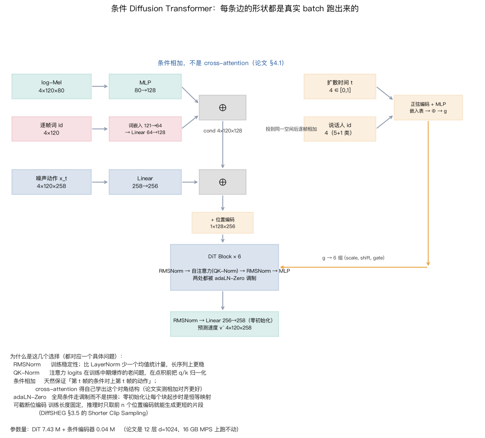
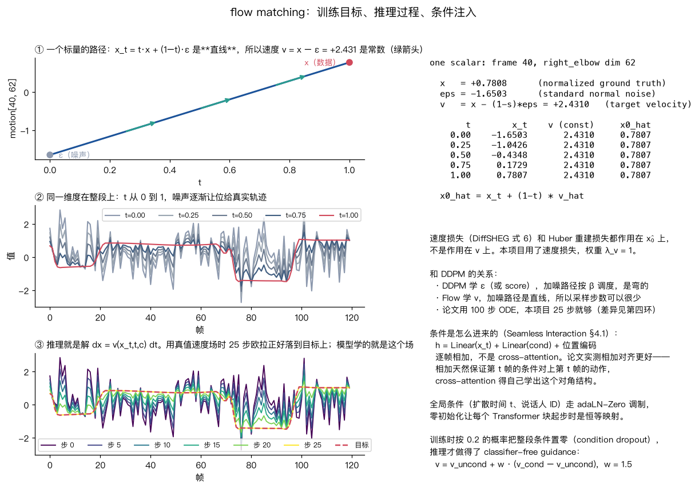

# 01 条件与模型：条件怎么进来，flow matching 在学什么

这一页讲两件事：**语音和文本怎么变成逐帧条件**、**生成模型的目标函数和结构**。
两件事都直接抄了 Seamless Interaction 论文 §4 的做法，每一个选择背后都有一个具体问题。

---

## 1. 条件：为什么是「逐帧相加」

论文 §4.1 末段说得很直白：条件用**相加**而不是 cross-attention，
因为这样生成的动作与语音**对齐更好**。

道理不难：动作特征是 `(T, 258)`，条件也是 `(T, 128)`，两者投到同一维度后逐帧相加，
**天然保证第 t 帧的条件对上第 t 帧的动作**。cross-attention 没有这个约束，
它要自己从数据里学出「注意力矩阵应该接近对角」这件事——能学到，但要花容量和数据。

论文表 15 有实测：标准自注意力 vs cross-attention，前者在唇同步（Sync-C 2.48 vs 0.31）
和 FID 上明显更好；cross-attention 只在 FFD 上占优。

```
h = Linear(x_t)      # (B,T,258) → (B,T,256)
  + Linear(cond)     # (B,T,128) → (B,T,256)
  + 位置编码          # (1,T,256)
```



### 音频那一路：三种表示

| 模式 | 是什么 | 对应论文里的什么 |
|---|---|---|
| `mel` | 80 维 log-Mel，hop = SR/fps = 735 采样点 | DiffSHEG 的低层特征 |
| `token` | 对 Mel 跑 k-means 得到离散 token，**12.5 fps** 算完再重采样回 30 fps | Seamless Interaction 的语音 tokenizer（§3.3） |
| `env` | 1 维能量包络 | 消融的下限 |

`token` 这一路专门复刻了论文提到的**帧率不匹配**：
「语音 12.5 fps 和视觉 30 fps 不匹配，条件要先重采样再相加」（§4.1）。
本项目的 `_downsample` / `_upsample_ids` 用的是最近邻，和论文一致的粗糙做法。

Mel 的 hop 直接取 `SR / fps`，所以**第 t 个 Mel 帧就是第 t 个动作帧**，
不需要任何重采样——这是刻意的，好让 `mel` 组成为「对齐最理想」的上限。

### 文本那一路：四种模式就是第二环的四组对照

| 模式 | 逐帧词 id 怎么算 | 携带了什么信息 |
|---|---|---|
| `seq` | 第 t 帧落在哪个词的区间里就是那个词 | 说了什么 ✅ + 什么时候说 ✅ |
| `shuffle` | 句内的词**换位**后铺到同样的时间轴 | 说了什么 ❌ + 什么时候说 ✅ |
| `bow` | 整句所有词的 id 循环平铺到每一帧 | 说了什么 ✅ + 什么时候说 ❌ |
| `none` | 全 0 | 都没有 |


这四组是**信息论上正交**的：`shuffle` 和 `bow` 各自砍掉一半信息，
所以如果 `seq ≫ shuffle ≈ bow ≫ none`，就说明两半信息缺一不可；
如果 `bow ≈ seq`，说明时机信息其实是从音频里补回来的。这两种结果都有意义。

---

## 2. 目标函数：flow matching

论文式 (1)：

```
x_t = t·x + (1 − (1−σ_min)·t)·ε ,   σ_min = 1e-4
目标速度 v = x − (1−σ_min)·ε
L_v = E‖ v_θ(x_t, t, c) − v ‖²
```

关键在于**加噪路径是直线**，所以速度是常数，模型要学的场比 DDPM 的简单，
采样步数可以少很多（论文用 100 步 ODE，本项目 25 步就够）。



一个真实数字（第 40 帧，`right_elbow` 的第 3 维，归一化后）：

```
x   = +0.7808     ε = −1.6503     v = x − (1−σ)ε = +2.4310

     t      x_t     v（常数）   从 v 反推的 x̂₀
  0.00  −1.6503     2.4310        0.7807
  0.25  −1.0426     2.4310        0.7807
  0.50  −0.4348     2.4310        0.7807
  0.75  +0.1729     2.4310        0.7807
  1.00  +0.7807     2.4310        0.7807
```

`x̂₀ = x_t + (1−t)·v̂` 这条式子很重要：速度损失（DiffSHEG 式 6）作用在 **x̂₀** 上，
不是作用在 v 上。本项目的总损失是

```
L = ‖v̂ − v‖²  +  λ_v · ‖Δx̂₀ − Δx‖²,   λ_v = 1
```

第二项是相邻帧差的 MSE，专门压抖动。

### 确定性回归的对照组怎么搭

`objective=regress` 时，**同一个骨干、同一份条件**，只是把噪声输入换成全零、
时间固定成 t=1、损失换成 L1。这样「生成式 vs 确定性」这组对照里变的只有目标函数一项。
这是第一环要回答的问题：co-speech gesture 是**多对多**映射
（同一句话可以配很多种合理的手势），确定性回归会收敛到条件均值，
表现出来就是「动作幅度小、看起来懒洋洋」——DiffSHEG 论文里对 CaMN 的描述就是
「much slower and less diverse motion」。

### CFG 需要训练时的条件 dropout 配合

训练时按 0.2 的概率把整段条件置零（说话人 id 同时换成 null 类），
推理才做得了 classifier-free guidance：

```
v = v_uncond + w · (v_cond − v_uncond),   w = 1.5
```

论文用的就是 dropout 0.2 / CFG 1.5，本项目照抄。

---

## 3. 结构：几个归一化选择各自解决什么

| 选择 | 解决的问题 |
|---|---|
| RMSNorm | 训练稳定性。比 LayerNorm 少一个均值统计量，长序列上更稳（论文 §4 引 Zhang & Sennrich 2019） |
| QK-Norm | 注意力 logits 在训练中期爆炸的老问题，在 q·k 点积**前**把 q、k 归一化 |
| adaLN-Zero | 全局条件（扩散时间 t、说话人 ID）走调制而不是拼接；零初始化让每个块起步时是恒等映射 |
| 可截断位置编码 | 训练长度固定，推理时只取前 n 个位置编码就能生成**更短**的片段（DiffSHEG §3.5） |

规模：DiT 6 层 / d=256 / 4 头 = **7.43 M** 参数，条件编码器 0.04 M。
论文是 12 层 / d=1024 / FFN 4096，在 16 GB MPS 上跑不动。
MPS 上 batch 32 × 窗口 120 帧，约 **2.2 步/秒**，8000 步约 1 小时。

---

## 4. 长序列：FOPPAS

`si/flow.py` 里的 `sample_long` 实现了 DiffSHEG §3.5 的做法：
一段一段生成，从第二段起把开头 `overlap` 帧**钉死**成上一段的结尾（outpainting，Repaint 的做法），
再在紧接着的几帧上做线性混合。

和「训练时就条件在前几帧上」的自回归做法相比，好处是 overlap 可以在推理时随便改，
第一段还能用 overlap=0 自由起手，不需要 seed motion。第四环会量化接缝处的速度突变。

---

## 复现

```bash
python scripts/explain_flow.py    # flow matching 的路径、数值表、ODE 轨迹
python scripts/explain_arch.py    # 结构图（形状从真实 batch 抓）
python scripts/explain_cond.py    # 四种文本模式
python -m si.train --config configs/flow_body.yaml --name flow_body
python -m si.eval --run runs/flow_body --video 3
```
