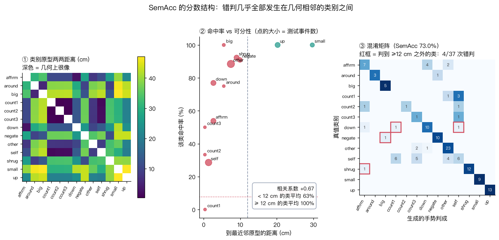
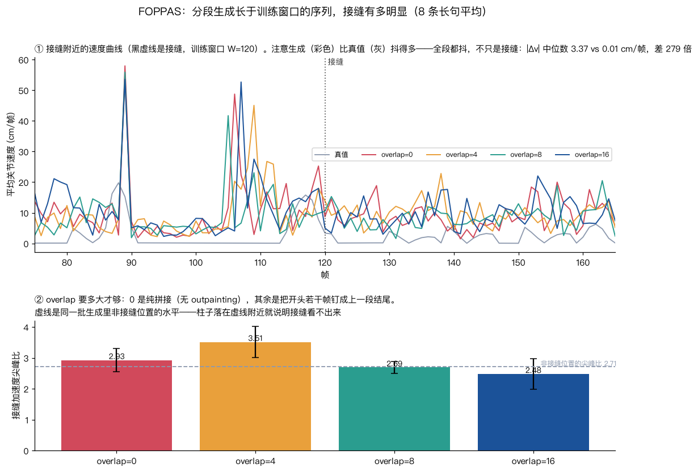

# 02 第一批结果：主基线、SemAcc 的分数结构、反事实、FOPPAS

主基线：flow matching + log-Mel + 逐帧词 id，8000 步，MPS 上 52 分钟（2.56 步/秒），
best 检查点在第 7500 步（val 0.0945）。
测试集 40 句 / 137 个语义事件。

---

## 1. 主基线数字

| 指标 | 值 | 参考 |
|---|---|---|
| **SemAcc ★** | **73.0 %** | 随机基线 7.7 %，真值上限 **100.0 %** |
| FGD | 0.375 | — |
| MPJPE | 9.56 cm | — |
| BeatAlign | 0.804 | 真值 0.659 |
| Diversity | 88.09 cm | — |

两件事马上要说清楚：

**BeatAlign 0.804 高于真值 0.659，这不是好事。** 参见 `notes/01` 和
`docs/figs/05_metrics.png`：这个指标对动作质量几乎不敏感，生成动作比真值抖，
检出的「动作节拍」就更多，于是每个语音节拍都更容易在附近找到一个动作节拍。
**指标比真值好，通常说明指标坏了，不是模型好了。**

**SemAcc 的上限是真的 100%。** 我专门用真值动作跑了一遍这个指标，
137 个事件全对——所以 73% 里那 27% 的差距全部是模型的问题，没有指标的锅。
这一步不能省：一个没有验证过上限的指标，分数低时你分不清是模型差还是尺子歪。

---

## 2. SemAcc 的分数结构：类别离得越开越容易判对

73% 不是均匀分布在 13 个类别上的，差异极大：

| 类别 | 到最近邻原型 (cm) | 最近邻 | 事件数 | 命中率 |
|---|---|---|---|---|
| count2 | 0.33 | count3 | 3 | 33.3 % |
| count3 | 0.33 | count2 | 2 | 50.0 % |
| count1 | 0.37 | count2 | 4 | **0.0 %** |
| self | 1.33 | count1 | 21 | 28.6 % |
| affirm | 2.66 | down | 13 | 53.8 % |
| down | 2.66 | affirm | 13 | 76.9 % |
| around | 5.50 | big | 4 | 75.0 % |
| big | 5.50 | around | 5 | 100.0 % |
| other | 7.44 | count3 | 26 | 88.5 % |
| shrug | 9.01 | around | 13 | 92.3 % |
| negate | 9.92 | around | 11 | 90.9 % |
| up | 20.23 | self | 13 | **100.0 %** |
| small | 29.71 | self | 9 | **100.0 %** |

相关系数 **+0.67**。到最近邻 ≥ 12 cm 的类别平均命中率 **100%**，
< 12 cm 的平均 **62.7%**。

更干净的一条：**37 次错判里，只有 4 次判到了 ≥12 cm 之外的类别。**
也就是说模型几乎从不「乱指」，它的错误全部发生在几何上本来就很像的邻居之间。



### 顺带发现的一个指标缺陷（要写在文档里，不要偷偷改指标）

`count1/count2/count3` 三个类别之间的原型距离只有 **0.33 cm**，
而全部类别间距的中位数是 5.5 cm。原因是这三个手势只差 1–3 根手指的弯曲，
而 SemAcc 用的是 44 个关节位置距离的**平均**——稀疏的差异被平均稀释掉了。

试过按「关节在 13 个原型之间的离散度」做尺度归一化，**没有用**：
归一化后 count2↔count3 是 0.01、中位数 0.21，比值还是 1/20。
问题出在**均值这个聚合方式**上，不是量纲。所以指标保持最朴素的定义，
把这个局限写在 `si/metrics.py` 的 docstring 和这里，而不是换一个看起来更聪明的尺子。

（另外验证过：把 count1/2/3 合并成一个类别重算，SemAcc 还是 73.0%，
一点没变——因为这三个类的错判去向是 `self` / `other` / `affirm`，
不是彼此。所以这确实不是「数错了几根手指」，是整个手势做错了。）

**这件事和论文对得上。** Seamless Interaction §3.1 说他们的身体重建用 HMR 2.0，
但「this body reconstruction cannot capture hand details; the hands are flat」，
所以又单独跑了 ViTPose 检测手 + HaMeR 估计手部姿态，再做一步坐标系对齐把手接回手腕。
**手指信息在以身体为中心的表示和损失里天然容易丢**——他们是在数据侧补的，
本项目遇到的是同一个问题在评测侧的版本。

---

## 3. 反事实：同一条语音，只换一个词

这是全项目最直接的一个证据，而且只需要主基线一个模型：
**音频一个采样点都不动**，只把喂给模型的那十几帧词 id 换掉。

```
句子：「yours moved the slider high and no changed for mine」
替换第 4 个词：high[up] → low[down]，只动帧 60–74
峰值帧 61 生成的手势判类：原文本 → up   反事实文本 → down
两段生成在该帧的关节位置差：22.9 cm
```

在测试集上批量跑 30 次换词：

| 问题 | 结果 |
|---|---|
| 原文本判对 | 14/30 = 46.7 % |
| 换词后判成**新**类别 | **26/30 = 86.7 %** [74, 99] |
| 换词后手势确实变了 | 25/30 = 83.3 % |
| 峰值帧的平均位移 | 16.6 cm |

（测试集里能换的词只有 30 处，所以样本量小，方括号是二项 95% 区间。
这批数字是主基线重评之后刷新的；早先贴过一版 83.3 / 86.7 / 21.0 cm，
生成是随机的，两次抽样的差落在区间内，结论不变。）

「换词后判对」(86.7%) 比「原文本判对」(46.7%) 还高，是因为替换的目标词
（`you`→other、`low`→down、`tiny`→small）恰好都落在可分性好的类别上，
而被替换的原词里混了 `self`、`count1` 这些几何上挤在一起的类。
和上一节的结论完全一致。

复现：`python scripts/counterfactual.py --run runs/flow_body --all`

---

## 4. FOPPAS：接缝测不出来，但原因不是它做得好

DiffSHEG §3.5 的说法是分段生成时把开头若干帧钉成上一段结尾（outpainting），
接缝就天然连续。本项目在 8 条长于训练窗口的测试句上量了「接缝加速度尖峰比」
（接缝附近的最大 |Δv| ÷ 全段 |Δv| 中位数）：

| overlap | 尖峰比 |
|---|---|
| 0（纯拼接，没有 outpainting） | 2.93 ± 0.38 |
| 4 | 3.51 ± 0.50 |
| 8 | 2.69 ± 0.19 |
| 16 | 2.48 ± 0.50 |
| **同一批生成里非接缝位置** | **2.71** |

四组都落在非接缝水平上，误差棒互相重叠——**接缝在统计上看不出来，
连 overlap=0 的纯拼接都看不出来。**

这个结论不能读成「FOPPAS 没用」。真正的原因写在图 ① 里：
**生成动作比真值抖得多，而且是全段都抖**：加速度 |Δv| 的中位数，生成是 3.37 cm/帧、
真值是 0.01 cm/帧。真值那一路是分段光滑的（专家动作由正弦和升余弦包络合成），
所以中位数接近 0；生成的每一帧都在抖。
论文要解决的「接缝可见」这个问题，前提是动作本身足够平滑到能看出接缝；
在当前的模型质量下，接缝被自身的抖动淹没了。

所以第四环真正该做的事变成了：**先把抖动压下去**（加大速度损失权重、
训久一点、或者上 DiffSHEG 的 Huber 重建损失），再回来量接缝。
这条已经写回 PLAN.md。



---

## 5. 三个被数据否掉的假设（记下来，免得再想一遍）

看到 `self`/`count*` 大面积混淆之后，依次试了三个解释，前两个都是错的：

**假设一：手指学不动。** 语义手势的区别很多落在手指上，而手指位移小，
在 L2 损失里权重低，所以模型学不到。
→ **否。** 按关节组拆开算「预测误差 ÷ 真值运动幅度」：
脊柱/头 2.70、肩/肘 1.00、腕 0.92、手指 0.98。手指并不比手臂差。
（顺带：这四个数都在 1.0 附近，说明逐帧预测误差和信号自身的标准差同量级——
这正是「MPJPE 对多对多任务没有意义」的另一个说法。）

**假设二：模型系统性欠幅（under-shoot），强手势被做成了它的温和版邻居。**
→ **否，而且反了。** 量了每个类别在峰值帧离静息姿态的距离：
生成/真值 = 1.09，模型整体**略微过冲**。过冲最厉害的是 affirm (1.19) 和
down (1.29)——恰好是原型幅度最小的两个类（20.8 / 19.6 cm），
说明模型做不出「幅度很小的手势」，会把什么都推到一个「典型手势幅度」上去。

**假设三：类别本身的几何可分性差异。**
→ **成立**，就是上面第 2 节的相关系数 +0.67 和「37 次错判只有 4 次跨簇」。

---

## 6. 待补

四组文本消融（`seq` / `shuffle` / `bow` / `none`）、目标函数消融
（flow vs 回归）、语音表示消融正在跑，结果出来补进这一页和 `notes/03`。

复现：

```bash
python -m si.eval --run runs/flow_body
python scripts/explain_semacc.py --run runs/flow_body
python scripts/counterfactual.py --run runs/flow_body --all
python scripts/explain_foppas.py --run runs/flow_body
```
