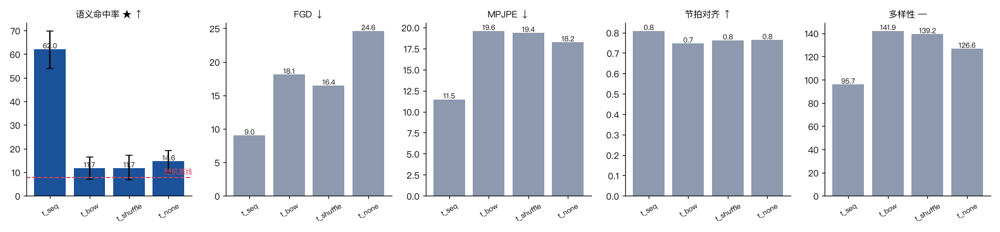

# 04 第二环（靶心）：文本到底有没有在起作用

四组只差一个变量：`text_mode`。音频、模型、训练步数（5000）全部相同。
测试集 40 句 / 137 个语义事件，随机基线 7.7%，真值上限 100%。

---

## 结果

| 组 | 携带的信息 | **SemAcc ★** | FGD ↓ | MPJPE ↓ | 节拍对齐 ↑ | 多样性 |
|---|---|---|---|---|---|---|
| `seq` 逐帧对齐的词 id | 说了什么 ✅ + 什么时候说 ✅ | **62.0 %** [53.8, 69.8] | **9.01** | **11.46 cm** | 0.81 | 95.7 cm |
| `bow` 整句词袋 | 说了什么 ✅ + 什么时候说 ❌ | 11.7 % [7.0, 16.4] | 18.08 | 19.58 cm | 0.75 | 142.0 cm |
| `shuffle` 句内换位 | 说了什么 ❌ + 什么时候说 ✅ | 11.7 % [6.8, 17.1] | 16.45 | 19.35 cm | 0.76 | 139.2 cm |
| `none` 没有文本 | 都没有 | 14.6 % [9.7, 19.3] | 24.60 | 18.24 cm | 0.76 | 126.6 cm |

方括号是按**句子**自助重采样的 95% 区间（2000 次）。

> 这是**统一重评之后**的权威数字。此前贴过一版（seq 66.4% / bow 16.8% / shuffle 12.4% / none 13.1%），
> 那一版的 FGD 因为自编码器不一致跨组不可比，SemAcc 也是另一次采样的抽样
> （生成是随机的，差异落在置信区间内）。结论方向完全一致，而且重评后更干净：
> **`bow` 和 `shuffle` 现在是同一个数（11.7%），`none` 反而名义上最高。**



---

## 三条结论

### 1. 文本条件不是「有帮助」，是「决定性的」

`seq` 62.0% vs 其余三组 11.7–14.6%，**差 4–5 倍**，置信区间完全不重叠。
FGD（9.01 vs 16–25）和 MPJPE（11.5 cm vs 18–20 cm）也跟着走。

### 2. 两半信息**缺一不可**，而且缺任何一半剩下的那半几乎一文不值

这是本环最值得记住的一条，也是我事先没料到的：

- `bow` 知道整句说了哪些词、不知道什么时候说 → 11.7%
- `shuffle` 知道每一刻在说词、但词是错的 → 11.7%
- `none` 什么都不知道 → 14.6%

**这三组的置信区间互相重叠，统计上不可区分**，而且全都贴着随机基线（7.7%）上方一点——
`none` 甚至名义上最高。

也就是说：不是「知道词能拿一半分、知道时机能拿另一半」。
**语义手势要求「在对的时刻做对的手势」，这是一个联合条件；
拆开之后任何一半单独都过不了门槛。**

对照 Seamless Interaction 论文 §4.4.3：他们为语义手势专门加了一路
**逐帧的手势条件**（而且做了随机时序 drop），而不是加一个句子级的语义标签。
这组实验给出了那个设计选择的量化理由——句子级的信息（`bow`）基本没用。

### 3. BeatAlign 在这里完全失明

四组的节拍对齐是 **0.81 / 0.75 / 0.76 / 0.76**——几乎完全一样，
而 SemAcc 在同一批模型上从 62.0% 掉到 11.7%。

这和 `notes/02` 里用加噪实验得到的结论是同一件事的第二个独立证据：
**BeatAlign 量的是「动作有没有在语音的节奏点上动」，
它对「动作对不对」一无所知。** 论文里那句
「Div 和 BA 只在动作平滑自然时才有意义」说得还算客气。

顺带：三个失败组的**多样性反而更高**（127–142 vs 95.7）。
模型拿不到有效条件时会在整个动作分布上乱撒，多样性自然高——
所以多样性高**不等于**建模得好。

---

## 一张图看明白

同一条语音、同一批语义时刻，只改文本条件：


`seq` 那一行五个时刻的姿态明显不同（指自己 / 向下 / 比小 / 向上 / 否定）；
另外三行几乎是同一个姿势重复五遍，全被判成 `down` 或 `other`——
**这就是「拿不到有效条件时模型退化成条件均值」的样子。**

动图版：`docs/figs/09_text_ablation.gif`

---

## 两个方法上的教训

### 教训一：长跑进程 + 磁盘缓存 = 必须带版本

FGD 的自编码器缓存在磁盘上给所有 run 共用。我中途把隐维度从 32 改成 16
（理由：40 句测试集估不出 32×32 的协方差），删掉了旧缓存——
但当时正在跑的 `si.ablate` 进程**内存里还是旧的模块**，于是它又按 32 维写了一个缓存回去。
下一个新进程加载时 shape mismatch，**直接崩在消融套件的评测阶段**，
而且因为输出被 `tail -50` 截掉、崩溃又是在训练日志之后，
表面上看只是「套件跑完了但没生成 json」——白白浪费了两轮训练才定位到。

修法两条，缺一不可：
1. 缓存文件名带上结构参数（`fgd_ae_body_120_d258_z16.pt`）；
2. 加载失败就重训，不要让评测挂掉。

### 教训二：40 句的测试集上，5 个百分点以内的差不该当成结论

第一版差点直接写「`bow` 16.8% 比 `none` 13.1% 好，说明知道有哪些词还是有点用」。
算完区间才发现这 3.7 个百分点落在噪声里。重评之后这两个数变成了 11.7% 和 14.6%
——**顺序都反过来了**，正好印证了那 3.7 个百分点确实什么都不是。

所以 `si/report.py` 现在**默认给主指标带自助区间**，表格下面固定写一句
「区间重叠的两组不要当成有差别」。
40 句的测试集上，5 个百分点以内的差都不该当成结论。

---

## 复现

```bash
python -m si.ablate --suite text --steps 5000
python -m si.report --ablation runs/ablation_text.json --out docs/figs/ablation_text.png
python scripts/explain_text_ablation.py     # 上面那张五宫格 + 同屏视频
```
