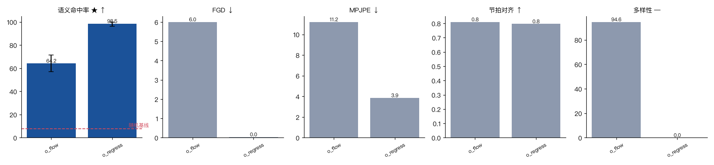

# 05 第一环：确定性回归完胜生成式——但这是我自己的任务设计问题

同一个 DiT 骨干、同一份条件、同样 5000 步，只换目标函数：

| 组 | **SemAcc ★** | FGD ↓ | MPJPE ↓ | 节拍对齐 | **多样性** |
|---|---|---|---|---|---|
| `o_flow` flow matching（生成式） | 64.2 % | 6.01 | 11.21 cm | 0.810 | 94.64 cm |
| `o_regress` L1 回归（确定性） | **98.5 %** | **0.04** | **3.86 cm** | 0.797 | **0.00 cm** |

（自助 95% 区间：flow 64.2% [56.9, 71.5]，回归 98.5% [96.3, 100.0]，完全不重叠。）



**确定性回归在除多样性以外的每一个指标上都碾压生成式。**

这和我事先写在 `PLAN.md` 和 `notes/01` 里的预期完全相反。当时的说法是：

> co-speech gesture 是**多对多**映射（同一句话可以配很多种合理的手势），
> 确定性回归会收敛到条件均值，表现出来就是「动作幅度小、看起来懒洋洋」。

这句话本身没错，错的是**它的前提在我造的数据上不成立**。

---

## 诊断：先量数据自己有多随机

一个模型不可能比数据本身的条件随机性做得更准。所以第一件事是量这个下限：
**同一句话、同一段语音，只换专家的随机种子，生成 5 次，两两算关节距离。**

```
data/toy（确定性版）   全段 3.37 cm   语义手势峰值帧 2.32 cm
```

对上表：

| 量 | 值 | 说明 |
|---|---|---|
| 数据自身的条件变异 | **3.37 cm** | 任何模型的 MPJPE 下限 |
| 回归的 MPJPE | **3.86 cm** | **已经贴着噪声底了** |
| flow 的 MPJPE | 11.21 cm | 离下限 3 倍远 |
| flow 的 Diversity | 94.64 cm | **是数据真实变异的 28 倍** |

结论很清楚：

- **回归赢，是因为这个任务在给定条件后几乎是确定性的。** 条件均值 ≈ 任何一个样本，
  所以回归到均值就是最优解，它做到了理论上能做到的极限。
- **flow 输的不是「多样性太低」，恰恰是「多样性太高」。** 它生成的变异是数据真实
  变异的 28 倍——它不是在建模多峰性，它只是不够准。

我造的数据里，只有 idle 摇摆（RMS 0.018 rad）和节拍手势偶尔换手是随机的；
语义手势在给定词之后完全确定。**这不是 co-speech gesture 该有的样子。**

---

## 这条论断本身是个好东西

「co-speech gesture 是多对多的，所以要用生成式模型」——
这在论文里是个前提，读的时候很容易当成定理接受。
它其实是一个**关于数据的经验性质**：只有当同一份条件真的对应多种合理动作时，
生成式才有优势。数据不满足这个性质时，回归不但不输，还会赢很多。

这也顺带解释了为什么本项目的 flow 模型 SemAcc 只到 64–73%：
它花了大量容量去建模一个几乎是点质量的分布，采样时自然会飘。

---

## 修法：把任务改成真的多对多，然后重跑

改的是**数据**，不是模型（`si/gesture_expert.py` 的三个旋钮，默认全 0）：

| 旋钮 | 值 | 为什么 |
|---|---|---|
| `omit_p` 语义词不做手势的概率 | 0.45 | **最重要的一个**。真人不会每个语义词都配手势；Seamless Interaction §4.4.3 明说语义手势稀有且长尾 |
| `mirror_p` 单手手势换成左手的概率 | 0.40 | 同一个意思，两种做法 |
| `amp_jitter` 幅度的乘性抖动 | ±35 % | 同一个手势，不同的用力程度 |

`python -m si.dataset 400 --multimodal` 产出 `data/toy_multi`：
400 句 / 1334 个语义事件，其中省略 593（44%）、换手 302（23%）。

重新量条件变异：

```
data/toy        （确定性版）  全段  3.37 cm   语义峰值帧  2.32 cm
data/toy_multi  （多峰版）    全段 15.12 cm   语义峰值帧 25.12 cm
```

**语义峰值帧上的条件变异涨了 11 倍。** 现在这个对照才有意义：
回归被迫输出条件均值（一个「手抬到一半」的模糊姿态），
而生成式可以采到某一个具体的模式。

指标那边配套改了两处：
- **判类要认镜像**：`class_prototypes(mirrored=True)` 给出左右互换的原型，
  判类时对两套都比一遍取最近——换手做的还是同一个手势。
- **省略的事件不计入 SemAcc**：那个词本来就没做手势，没什么可判的。

重跑已排进队列：`python -m si.ablate --suite objective_multi --steps 5000`。

---

## 一个更一般的教训

这是本项目第二次被「任务设计」而不是「模型」绊住
（第一次是 `count1/2/3` 三个类别只差手指、在平均关节距离下几乎不可分，见 `notes/02`）。

两次的共同点：**指标和模型都没问题，是我造的任务没有承载我想问的那个问题。**
所以造数据的时候，除了写生成规则，还得**量一个「这个任务到底有多难 / 有多随机」的数**——
本项目现在的做法是：任何一个新数据版本，先跑一遍
「同一条件换随机种子 K 次，两两距离」，把噪声底摆出来，再看模型的分数。

---

## 复现

```bash
python -m si.ablate --suite objective --steps 5000          # 确定性版数据
python -m si.dataset 400 --multimodal                       # 造多峰版
python -m si.ablate --suite objective_multi --steps 5000     # 多峰版数据
```
