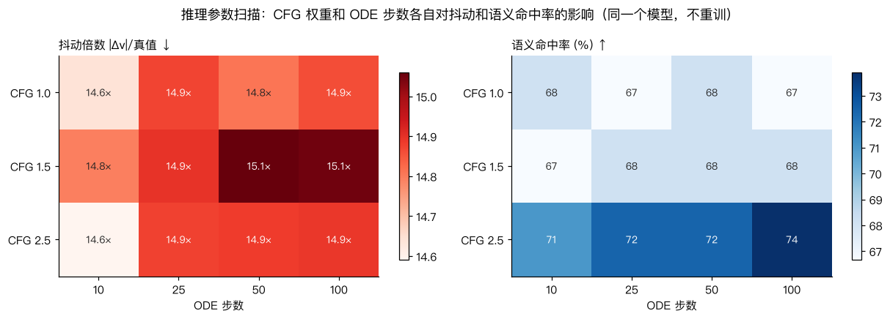

# 07 抖动：三个环撞到的同一个根因

## 症状

三个环各自撞到一个"说不通"的现象，回头看是同一件事：

| 环 | 现象 | 当时的解释 |
|---|---|---|
| 4 FOPPAS | overlap = 0 / 4 / 8 / 16 的接缝**测不出差别**，而且和非接缝位置一样 | 全段都抖，接缝不显眼 |
| 6 双人 | 生成了 431–467 个点头去对 187 个真值事件 | 抖动被点头检测器当成点头 |
| 1 目标函数 | flow 的 Diversity 是真值条件变异的 **28 倍** | "多样性"其实是抖动 |

## 量化

指标用 **|Δv| 的中位数**：v 是逐帧的平均关节位移（cm/帧），Δv 是它的一阶差分。
取中位数是为了不被单点异常带偏。

```
真值（规则专家）      0.270 cm/帧
flow_body 生成        3.83  cm/帧      → 14.2 倍
```

（都在**完整测试集**上算。这一点要固定：真值抖动在不同句子上差异很大——
前 8 条 0.138、前 12 条 0.206、全部 40 条 0.270——早期我用 8 条量出「25 倍」
写进了文档，后来统一改成完整测试集，绝对数字订正为 14.2 倍，结论方向不变。）

肉眼也看得见——[`videos/05_jitter.mp4`](../videos/05_jitter.mp4) 里手腕拖尾，
真值是光滑的弧线，生成是毛刺。


> 一个必须写清楚的限定：**本项目的真值是程序生成的，比真人动捕光滑得多**
> （正弦 + 升余弦包络，没有传感器噪声）。所以「14 倍」不能直接和真实数据上的数字比。
> 但它在**各组模型之间**是可比的，用来选配置没问题。

## 先排除便宜的解释：推理参数

抖动可能来自采样而不是模型：CFG 会放大 `v_cond − v_uncond`，
如果两个分支在高频上不一致，CFG 就会把高频噪声放大；ODE 步数太少也会有数值误差。
**这两个都是推理时参数，不用重训就能扫。**

扫了 CFG ∈ {1.0, 1.5, 2.5} × 步数 ∈ {10, 25, 50, 100} 共 12 组：

```
抖动倍数全部落在 14.59 – 15.06 之间
SemAcc      66.7 – 73.9 %
```



**结论是干脆的负面：推理参数完全压不住抖动。** 它是训出来的，只能从损失函数下手。

（顺带一条：CFG = 2.5 的 SemAcc 略高于 1.0（71–74 % vs 67–68 %），
但在 20 条句子的规模下读不出意义。本项目默认的 1.5 不吃亏。）

## 第二个线索：条件本身也是抖动源

第三环（语音表示）的结果里藏着一条：

| 音频条件 | FGD | SemAcc |
|---|---|---|
| `mel` 80 维 log-Mel | 5.05 | 62.0 % |
| `token` 离散语音 token | **0.39** | **72.3 %** |
| `env` 1 维能量包络 | 0.94 | 68.6 % |
| `none` 完全没有音频 | 0.78 | 68.6 % |

同为 5000 步时 `mel` 的 FGD 是 `token` 的 13 倍。
但主基线（也是 `mel`）训到 8000 步后 FGD 降到 0.53，
所以准确的说法是 **`mel` 收敛更慢**。完整讨论见 [`notes/08`](08-第三环-语音表示.md)。

## 正在跑的实验

从损失函数下手，四组只改损失权重（`si/ablate.py` 的 `smooth` 套件）：

| 组 | 变量 | 出处 |
|---|---|---|
| `s_v1` | λ_v = 1（现状） | — |
| `s_v5` | λ_v = 5 | 速度损失，DiffSHEG 式 (6) |
| `s_v20` | λ_v = 20 | 同上，加到极端 |
| `s_huber` | λ_v = 5 + Huber 重建损失 λ_δ = 1 | DiffSHEG 式 (7)(8)，直接约束 x̂₀ |

结果出来后补在这里。要看的是**抖动倍数**和 **SemAcc** 的权衡：
把速度损失压到极端会不会同时把语义手势的幅度压没。

## 复现

```bash
python scripts/explain_jitter.py --sweep runs/flow_body          # 推理参数扫描
python -m si.ablate --suite smooth --steps 5000                  # 损失函数对照
python scripts/explain_jitter.py --runs runs/smooth_s_v1 runs/smooth_s_v5 \
       runs/smooth_s_v20 runs/smooth_s_huber --labels λv=1 λv=5 λv=20 +Huber
```
