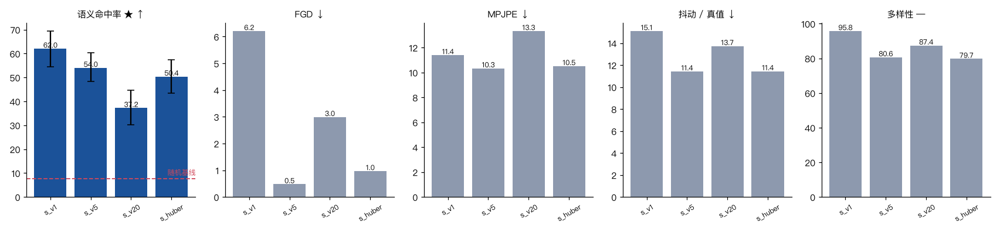

# 09 第八环：速度损失不是抖动的答案

四组只改损失权重，其余全同（Mel + 逐帧词 id、5000 步）。

| 组 | **SemAcc ★** | FGD ↓ | MPJPE ↓ | **抖动 / 真值 ↓** | 多样性 |
|---|---|---|---|---|---|
| `s_v1` λ_v = 1（现状） | **62.0 %** [54.3, 69.4] | 6.21 | 11.40 cm | 15.10× | 95.8 cm |
| `s_v5` λ_v = 5 | 54.0 % [48.2, 60.3] | **0.48** | **10.34 cm** | **11.43×** | 80.6 cm |
| `s_v20` λ_v = 20 | 37.2 % [30.3, 44.5] | 2.99 | 13.33 cm | 13.73× | 87.4 cm |
| `s_huber` λ_v = 5 + Huber | 50.4 % [43.4, 57.4] | 0.97 | 10.51 cm | 11.44× | 79.8 cm |



> ⚠️ **FGD 这一列在 5000 步远未收敛，反映的是收敛速度而不是最终质量。**
> 证据：同一个配置（Mel + λ_v=1 + 5000 步）的两个独立 run 是 **5.05** 和 **6.21**，
> 而同配置训到 8000 步是 **0.53**——差一个数量级。
> 所以跨组比 FGD 时，只能说「谁收敛得快」，不能说「谁最终更好」。
> SemAcc / MPJPE / 抖动这三列受这个问题的影响小得多。


---

## 结论一：速度损失确实压抖动，但只压得动 24%，而且要拿语义命中率去换

λ_v 从 1 加到 5：抖动 **15.10× → 11.43×**（降 24%），
FGD **6.21 → 0.48**（好 13 倍），MPJPE 也降了。

代价是 SemAcc **62.0 % → 54.0 %**。两组的自助区间（[54.3, 69.4] 和 [48.2, 60.3]）
在边界上勉强相接，所以这个下降**接近但没到统计显著**——不过方向和 λ_v=20 的结果一致。

一个自洽的解释：**平滑和语义锐度是有张力的。**
语义手势要求快速、果断的起手；速度损失惩罚的是「帧间差预测错了多少」，
模型在不确定时压低运动幅度就能降低这一项——
这和 L1 回归收敛到条件均值是同一个机制，只不过发生在速度上。

## 结论二：λ_v = 20 两头都输，说明它不是个单调的旋钮

λ_v 从 5 加到 20：SemAcc 塌到 37.2 %，而抖动**反而变差**（11.43× → 13.73×）。

所以「加大平滑权重 → 动作更平滑」这个直觉是错的。
超过某个点之后，速度项主导了梯度，主任务（预测速度场）学不好，
动作既不准也不平滑。

## 结论三：Huber 重建损失没有额外贡献

`s_huber` 和 `s_v5` 的抖动几乎一模一样（11.44× vs 11.43×），SemAcc 还低了 3.6 个百分点。
DiffSHEG 式 (7) 的 Huber 项在本项目的规模上没看出作用。

---

## 所以抖动这件事目前是什么状态

| 试过的 | 结果 |
|---|---|
| 推理参数（CFG × ODE 步数，12 组） | **完全无效**，14.59–15.06× |
| 速度损失 λ_v = 5 | 降 24%，到 11.43×，代价是 SemAcc −8 个百分点 |
| 速度损失 λ_v = 20 | 两头都输 |
| Huber 重建损失 | 无额外贡献 |

**抖动仍然是真值的 11 倍以上，没有解决。**

接下来还没试的（按性价比，见 [`docs/improve.md`](../docs/improve.md)）：

1. **权重 EMA** —— 扩散/流模型的标配，成本几乎为零，我一开始漏了。正在跑。
2. **离散语音 token 条件** —— 第三环显示同步数下 FGD 好 13 倍；
   高维连续 Mel 可能本身就在往动作里灌高频。正在跑。
3. 更长训练、更大数据（2000 句已经造好）。
4. 如果这些都不行，就该怀疑是**模型容量**或**动作表示**层面的问题了——
   比如 6D 旋转的每一维都独立回归，没有任何时间平滑的先验。

---

## 一个选配置的方法问题

`scripts/run_v2.sh` 里挑配置的规则是「在 SemAcc 不比最好那组低 5 个百分点以上的前提下，
取抖动最低的」。按这条规则选中的是 `s_v1`（λ_v = 1）——因为其余三组的 SemAcc 都掉了 8 个百分点以上。

**这条规则值得写出来而不是藏在脚本里**：它等价于声明「SemAcc 是主指标，
抖动是次要目标，且不接受主指标掉超过 5 个百分点」。
换一个人可能会选 `s_v5`（FGD 好 13 倍、抖动低 24%，只是 SemAcc 差 8 个点）。
**没有唯一正确答案，但必须把取舍写明。**

一个没试过的中间值：λ_v = 2。如果 SemAcc 只掉 2–3 个点而抖动降 15%，那可能是更好的折中。

## 复现

```bash
python -m si.ablate --suite smooth --steps 5000
python -m si.report --ablation runs/ablation_smooth.json --out docs/figs/ablation_smooth.png
```
