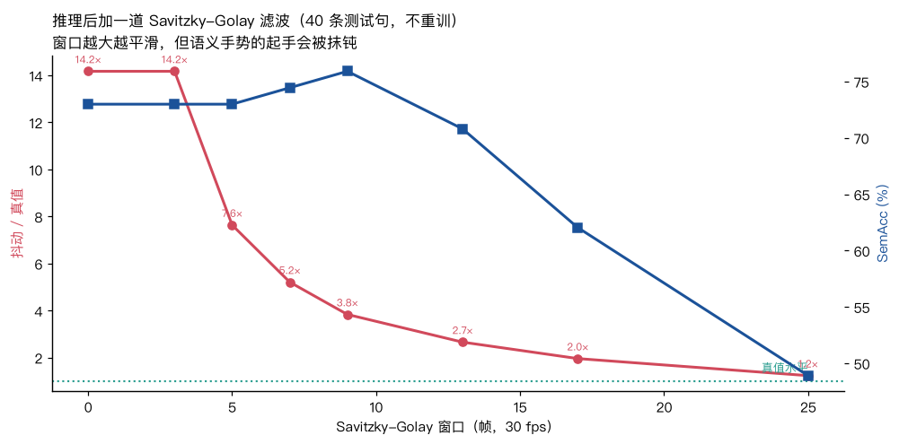

# 10 推理后平滑：一个零成本的大改善，但不是免费的

训练侧压抖动的三条路都试过了（速度损失、Huber、加大权重），最好只降 24% 且要拿
8 个百分点的 SemAcc 去换（见 [`notes/09`](09-第八环-平滑性.md)）。
推理参数（CFG × ODE 步数，12 组）完全无效。

还剩一条最土的：**生成完之后直接滤一遍**。

来路不是我拍脑袋——**Seamless Interaction §4.1 就对训练数据的 SMPL-H 参数做过
Savitzky-Golay 平滑**，用来去掉重建带来的抖动。既然真值那边用了，生成结果上也可以用。

---

## 结果（主基线，完整测试集 40 句，不重训）

| SG 窗口 | 抖动 / 真值 ↓ | MPJPE ↓ | **SemAcc ★** |
|---|---|---|---|
| 0（不滤） | 14.17× | 9.53 cm | 73.0 % |
| 5（167 ms） | 7.64× | 8.14 cm | 73.0 % |
| 7（233 ms） | 5.21× | 7.66 cm | 74.5 % |
| **9（300 ms）** | **3.84×** | **7.40 cm** | **75.9 %** |
| 13（433 ms） | 2.66× | 7.23 cm | 70.8 % |
| 17（567 ms） | 1.96× | 7.29 cm | 62.0 % |
| 25（833 ms） | 1.24× | 7.68 cm | 48.9 % |



**窗口 9 是甜点：抖动降 73%、MPJPE 降 22%、SemAcc 还涨了 2.9 个百分点。**
比训练侧任何一条都好，而且成本是零。

SemAcc 为什么会**涨**？因为判类是拿峰值帧的姿态去比 13 个原型，
抖动给姿态加了随机偏移，会把它推向错误的原型。滤掉抖动，判类自然更准。

窗口再大就开始伤语义了：25 帧（833 ms）时 SemAcc 塌到 48.9%——
语义手势的起手被抹钝，峰值帧的姿态和相邻帧混在一起。

## 在第二个模型上完全复现

只在主基线上看到的效应不算数。换 `audio_a_token`（离散语音 token 条件、5000 步）再跑一遍：

| | SemAcc | MPJPE | 抖动 / 真值 | FGD |
|---|---|---|---|---|
| 不平滑 | 72.3 % | 10.50 cm | 15.11× | **0.392** |
| SG 窗口 9 | **73.7 %** | **8.60 cm** | **4.33×** | 22.773 |

和主基线上的模式一模一样：抖动降 71%、MPJPE 降 18%、SemAcc 涨 1.4 个百分点、FGD 大幅变差。
**两个不同条件、不同训练步数的模型给出同一个结论**，这条可以信。

---

## 但 FGD 大幅变差，这一条必须写清楚

```
窗口 0：FGD 0.533        窗口 9：FGD 19.224
```

一开始我以为这是「其他三个指标都好了，只有 FGD 反常」，于是做了个对照实验：
**把真值动作自己滤一遍，再和真值比 FGD。** 理论上这应该几乎不变。

| 处理 | 抖动 |Δv| | FGD（对真值） |
|---|---|---|
| 真值本身 | 0.270 | 0.000 |
| 真值 + SG 窗口 5 | 0.509 | 0.072 |
| 真值 + SG 窗口 9 | 0.571 | **1.296** |
| 真值 + SG 窗口 13 | 0.466 | 3.428 |
| 真值 + SG 窗口 25 | 0.234 | 14.332 |

两件事：

**（1）FGD 对频谱变化极其敏感。** 只是把真值滤一遍，FGD 就从 0 涨到 1.30。
所以生成结果那边 19.2 里有一部分是**指标假象**。

**（2）但假象解释不了全部。** 1.30 vs 19.2 差了 15 倍，
说明平滑后的生成动作在自编码器的隐空间里**确实**离真值分布更远了。

所以这不是「免费的胜利」，是一个**真实的权衡**：
用 FGD 换抖动、MPJPE 和 SemAcc。

> 顺带暴露了 FGD 在本项目里的另一个问题：它是用 **40 个样本**在 **16 维**隐空间里
> 估两个高斯再算距离。这个样本量下协方差估计本身就很不稳。
> 加上对频谱的敏感，**我不太信这里的 FGD 绝对值**——
> 它适合比「同样处理方式下谁离真值近」，不适合跨处理方式比。

**（3）SG 在已经很平滑的信号上会反过来加抖动。** 真值原本 0.270，
滤完窗口 5 变成 0.509、窗口 9 变成 0.571。这是 SG 的过冲加上 6D 重新正交化的非线性。
所以「滤完之后 3.84× 真值」这个说法其实低估了改善——
如果和**同样滤过的真值**比（0.571），比值只有 1.8×。

---

## 它帮到了谁：只帮几何上挤在一起的类别

按「到最近邻原型的距离」把 13 个类别分成两组（主基线，窗口 9）：

| | 不平滑 | SG 9 | 事件数 |
|---|---|---|---|
| 离得开（≥ 12 cm） | 95.5 % | 95.5 % | 22 |
| **紧簇（< 12 cm）** | 68.7 % | **72.2 %** | 115 |

离得开的类别本来就接近饱和，平滑帮不上也伤不着；
**改善全部来自那些几何上挤在一起、原本被抖动推到隔壁的类别**——
这和「抖动给姿态加随机偏移、把它推向错误原型」的解释完全一致。

### 但有两个类别反而变差了，而且可能有机制

| 类别 | 不平滑 → SG 9 | n |
|---|---|---|
| `count2` | 33.3 % → **100 %** | 3 |
| `count3` | 50 % → **100 %** | 2 |
| `down` | 61.5 % → **92.3 %** | 13 |
| `other` | 88.5 % → 96.2 % | 26 |
| **`affirm`** | 61.5 % → **38.5 %** | 13 |
| **`self`** | 23.8 % → **14.3 %** | 21 |

> ⚠️ **单看每一类都不可靠**：n 只有 2–26，`count2` 那个 +66.7 只是 3 个事件里多对了 2 个。
> 能读的只有上面的聚合数（115 个事件）。

不过 `affirm` 变差有一个说得通的机制，值得单独测：
**`affirm` 是点头，颈部俯仰在 1.5 Hz 上振荡**（`si/gesture_expert.py` 里写死的），
而 9 帧 @ 30 fps 的窗口截止频率大约在 **1.7 Hz**——正好压在点头的频段上，
把振荡滤掉了。

同样是周期性手势的 `negate`（摇头 1.6 Hz）却没掉（90.9% → 90.9%），
因为它的手臂姿态本身就够特别，不靠头部振荡判类。

**所以窗口不该拍脑袋定，要看数据里最快的那个有意义的运动有多快。**
本项目最快的是点头/摇头的 1.5–1.6 Hz，那窗口就该短于 ~1/(2×1.6) ≈ 310 ms。
窗口 7（233 ms，截止 ~2.1 Hz）在整体 SemAcc 上是 74.5%，略低于窗口 9 的 75.9%，
但可能保住了点头——这一条还没单独验证。

---

## 两个使用上的限定

1. **这是后处理，模型本身照样抖。** 我们只是把抖动滤掉了。
   要真正解决，还得回到训练或表示层面（见 [`docs/improve.md`](../docs/improve.md)）。
2. **中心窗口意味着 150 ms 的延迟。** 流式实时场景（论文的 FOPPAS 就是冲这个去的）
   要么改成因果滤波（只用过去的帧，代价是相位失真），要么接受这个延迟。

---

## 怎么用

默认**关**——不能悄悄改掉历史结果的可比性。显式打开：

```bash
python -m si.eval --run runs/flow_body --smooth 9
python scripts/explain_smoothing.py --run runs/flow_body    # 扫窗口
```

代码在 `si/flow.py` 的 `savgol_smooth`，`si/eval.py` 的 `--smooth` 会把窗口记进 `eval.json`。
